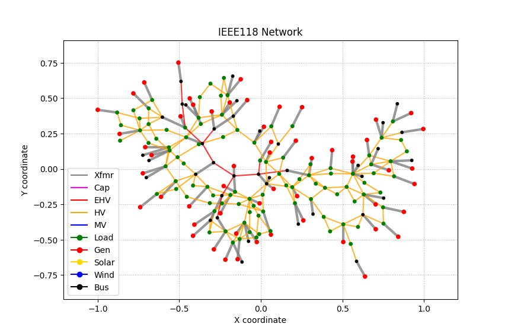
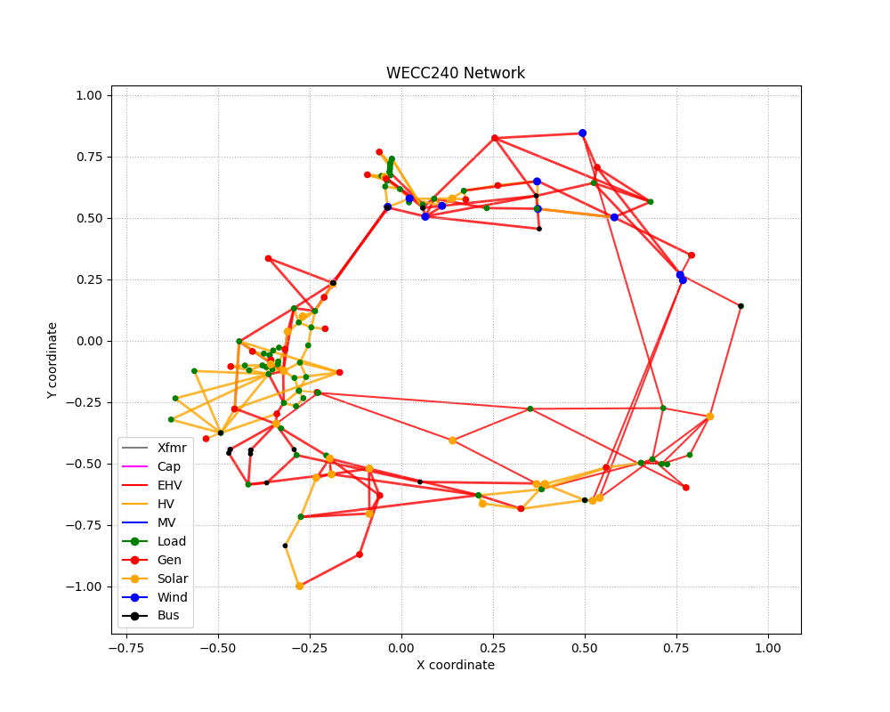

CIMHub Test Cases for Bulk Electric Systems (BES)
=================================================

Copyright (c) 2017-2024, Battelle Memorial Institute

Contents
--------

This directory contains two medium-scale BES test systems:

- `IEEE 118-bus System with IBR <https://doi.org/10.1109/TEMC.2019.2920271>`_
- `WECC 240-bus System with IBR <https://www.nrel.gov/docs/fy22osti/82287.pdf>`_

The following auto-layouts are approximately to scale, but not necessarily oriented to North.

The models will be available in the following formats:
 
- IEC Common Information Model (CIM)
- `MATPOWER <https://matpower.org/>`_
- `EMTP <https://emtp.com/>`_
- `Alternative Transients Program (ATP) <https://www.atp-emtp.org/>`_

Developers of tools not listed may work with the CIMHub team on converters from CIM to those other tools.

Steps to Create CIM
-------------------

- From the ``raw`` subdirectory, execute the ``deploy.bat`` command on Windows, or equivalent commands on Linux.
- Switch back to this directory for outputs; network data in ``IEEE118_CIM.xml`` and ``WECC240_CIM.xml``
- CIM identifiers (mRIDs) in ``IEEE118mRID.dat`` and ``WECC240mRID.dat``

Adding Locations to CIM
-----------------------

- Start the Blazegraph database engine, unless it's already running
- ``python loadxml.py`` empties the database, then loads both test systems.
- ``python bes_cim_loc.py 0`` creates locations for the IEEE 118-bus test system. The CoordinateSystem and Location mRIDs persist in ``IEEE118_Loc_mRID.dat``, but the PositionPoint mRID values change each time because PositionPoints do not have names; these changes do not affect the network model or layout.
- ``python bes_cim_loc.py 1`` creates locations for the WECC 240-bus test system. The CoordinateSystem and Location mRIDs persist in ``WECC240_Loc_mRID.dat``, but the PositionPoint mRID values change each time because PositionPoints do not have names; these changes do not affect the network model or layout.
- ``python loadloc.py`` adds these locations to the database.
- ``python bes_make_graph.py 0`` creates ``IEEE118_Network.json`` for plotting.
- ``python bes_make_graph.py 1`` creates ``WECC240_Network.json`` for plotting.
- ``python plot_bes.py 0`` plots the network layout saved in ``IEEE118.png``
- ``python plot_bes.py 1`` plots the network layout saved in ``WECC240.png``

Steps to Create MATPOWER
------------------------

- Start the Blazegraph database engine, unless it's already running
- The network data from ``loadxml.py`` should already be in the database. If not, execute ``python loadxml.py``.  The location data is not required or used with MATPOWER export.
- ``python bes_make_mpow.py 0`` creates a MATPOWER base case in ``IEEE118.m``
- ``python bes_make_mpow.py 1`` creates a MATPOWER base case in ``WECC240.m``
- ``python mpow.py 0`` solves a MATPOWER base case in ``IEEE118.m`` and writes initial conditions for ATP
- ``python mpow.py 1`` solves a MATPOWER base case in ``WECC240.m`` and writes initial conditions for ATP

Steps to Create EMTP and ATP
----------------------------

Models and scripts for these formats are only available to licensed users of the simulators.
