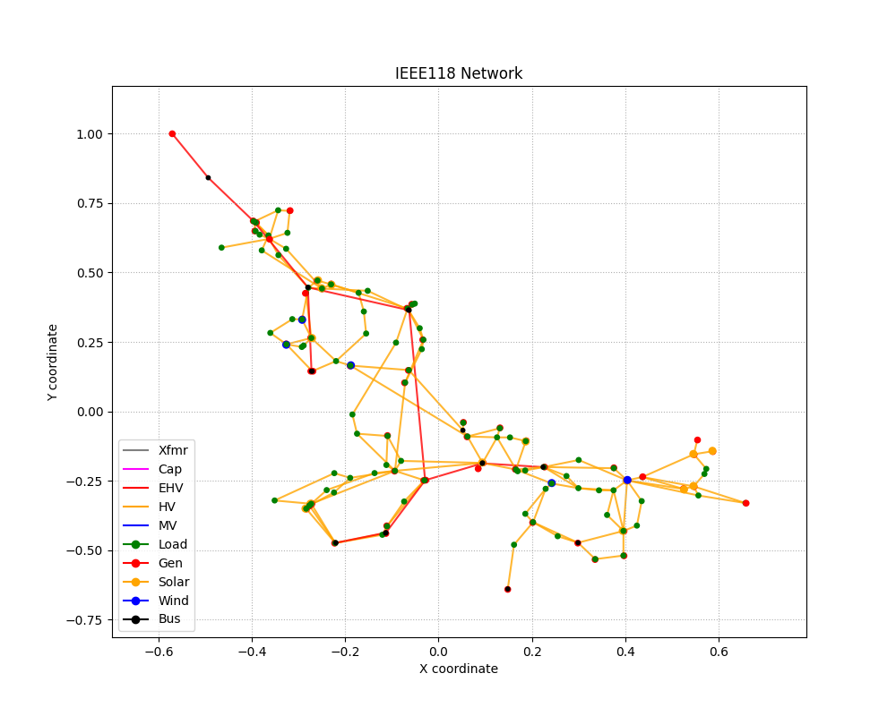

CIMHub Test Cases for Bulk Electric Systems (BES)
=================================================

Copyright (c) 2017-2023, Battelle Memorial Institute

Contents
--------

This directory contains two medium-scale BES test systems:

- `IEEE 118-bus System with IBR <https://doi.org/10.1109/TEMC.2019.2920271>`_
- `WECC 240-bus System with IBR <https://www.nrel.gov/docs/fy22osti/82287.pdf>`_

The following layouts are not to scale.

The models will be available in the following formats:
 
- IEC Common Information Model (CIM)
- MATPOWER
- Alternative Transients Program (ATP)
- EMTP

Developers of tools not listed may work with the CIMHub team on converters from CIM to those other tools.

