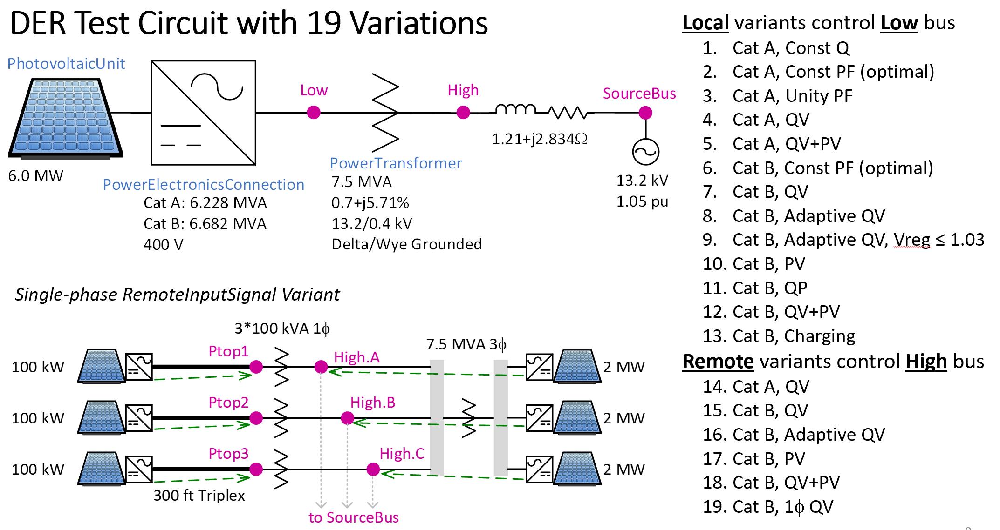

IEEE 1547-2018 Inverter Models
------------------------------

Copyright (c) 2021-2022, Battelle Memorial Institute

These test cases are based on a 6-MW photovoltaic system, connected 
through a delta-wye transformer to a 13.2-kV distribution circuit.  The 
point of common coupling (PCC) is on the high side of the transformer.  
When the photovoltaic system generates a full 6 MW and the grid source 
voltage is 1.05 per-unit, the PCC voltage will rise to 1.08 per-unit, 
which is into the B Range defined in ANSI/IEEE C84.1.  However, the smart 
inverter functions can mitigate the voltage rise.  See IEEE P1547.2/D6.2 
for more background on how the smarter inverter functions work, including 
how settings are determined.  IEEE 1547-2018 defines Category A and 
Category B for the reactive power and control capabilities of distributed 
energy resources.  Ultimately, these CIMHub test cases will encompass all 
functionality specified in IEEE 1547-2018, but some necessary features are 
currently missing in OpenDSS and/or CIM.  

The category B reactive power capability requirement is 44% of nameplate 
apparent power, absorbing or injecting.  For category A, the requirement 
is 44% injecting and 25% absorbing.  For a real power rating of 6000 kW, 
the nameplate S=6000/sqrt(1-0.44^2) = 6682 kVA for category B.  The 
reactive power limits are 0.44*6682 = 2940 kVAR.  The minimum power factor 
is 6000/6682 = 0.8980.  The optimal power factor for the test circuit is 
0.92 absorbing, at which the voltage fluctuations are approximately zero 
when the real power fluctuates.  Category B allows the power factor to be 
0.92 absorbing.  

For category A, the nameplate rating is also 6682 kVA, but the reactive 
power absorption capability is 0.25*6682 = 1670 kVAR.  GridLAB-D doesn't 
have separate limits on reactive power injection and absorption.  To 
represent the limit on reactive power absorption, we set S = sqrt(6000^2 + 
1670^2) = 6228 kVA.  This has a side effect of limiting the reactive power 
injection to 1670 kVAR instead of 2940 kVAR, but it's more important to 
accurately represent the absorption capability.  For absorption, the 
minimum power factor is 6000/6228 = 0.9634.  Therefore, the optimal power 
factor is not 0.92 for category A; it must be limited to 0.9634.  

Process
^^^^^^^

The test cases in *cases.json* are configured as decribed in 
`Test Case Configuration <../README.rst#Test-Case-Configuration>`_. The
`Command-Line Reference <../README.rst#Command-Line-Reference>`_ describes available
**export\_options** for each case.

The test cases are executed with *python3 onestep.py*. They cover:

1. Operation at unity power factor.
2. Operation at fixed reactive power.
3. Operation at the optimal power factor that minimizes impact on voltage. 
   The achievable optimal power factor differs for Category A and B, because 
   their reactive power ratings are different.
4. Volt-var control, for Category A and B, including autonomously 
   adjusting reference voltage.
5. Volt-watt control for Category B.
6. Coordinated Volt-var and Volt-watt control for Categories A and B.

Results
^^^^^^^

CIM currently supports only the first 4 cases, which involve fixed power 
factor or fixed reactive power.  The other 6 cases involve smart inverter 
functions, to be implemented with CIM Dynamics profile.  GridLAB-D 
comparison has been skipped for those 6 cases, pending the implementation 
of CIM Dynamics.  (Note: the apparent sgood agreement in OpenDSS solution 
for those 6 cases is artificial, because the solved P and Q from the base 
case is exported to the converted case as a fixed operating point.) 

All test cases respond to voltage at the point of connection, on the low 
side of the transformer.  OpenDSS does not presently support inverter 
control sensing at other points in the network.  

Notes: 

- At 1.05 per-unit, the high-side voltage should be 8002 volts
- The AVR-B case should do a better job of mitigating the voltage rise (to investigate)

The branch for comparison is the injection into the high side of the 
DER interconnection transformer.

See `Round-trip Validation <../README.rst#Round-trip-Validation>`_ for notes on 
interpreting the `Results <onestep.inc>`_.

.. literalinclude:: ../der/onestep.inc
   :language: none

Notes on OpenDSS Conversion
^^^^^^^^^^^^^^^^^^^^^^^^^^^

The results for autonomously adjusting reference voltage (AVR) cannot be compared closely, 
because of variations used in the test cases:

- The baseline ``local_avr_b`` simulation had ``vregmax=1.03``, which is not supported in CIM. 
  The exported case uses default ``vregmax=1.05``, which allows the terminal voltage to be higher.
- The baseline ``remote_avr_b`` was set up with dynamic reactive current mode, because the 
  OpenDSS ExpControl does not support monitoring remote buses. The exported model uses ExpControl 
  because the AVR implementation is better, but the remote monitoring signals are not exported.

In the last case, ``default_avr_b``, the base attribute values were set to facilitate a match.

Notes on GridLAB-D Conversion
^^^^^^^^^^^^^^^^^^^^^^^^^^^^^

Unsupported features were removed from the model, to improve GridLAB-D comparisons:

- Transformer core losses and magnetizing currents were removed
- The positive-sequence grid impedance at the PCC is represented in a series reactor, 
  instead of built in to the source.

Other notes:

- The default solar insolation in GridLAB-D is affecting the match for many comparisons, 
  see `GridLAB-D Issue 1333 <https://github.com/gridlab-d/gridlab-d/issues/1333>`_
- The fixed-Q case does not seem to absorb reactive power in GridLAB-D
- There is no provision for Q limits in GridLAB-D, only on the total apparent power

