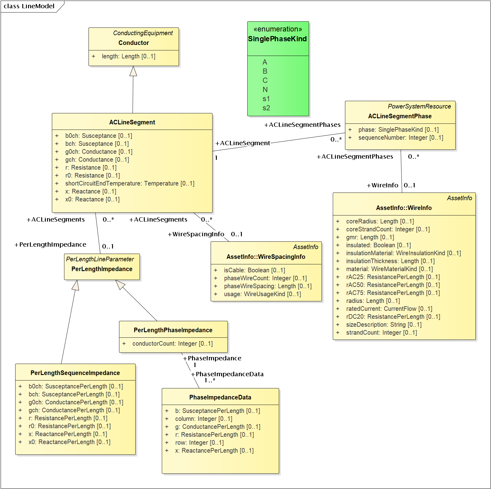
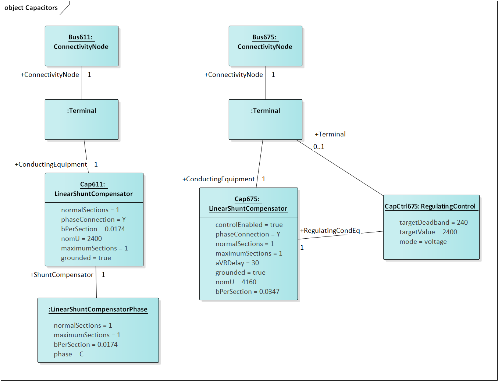
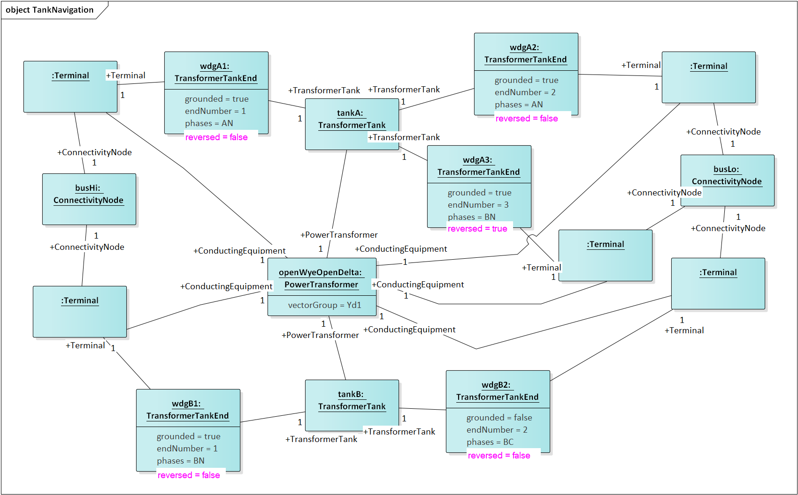
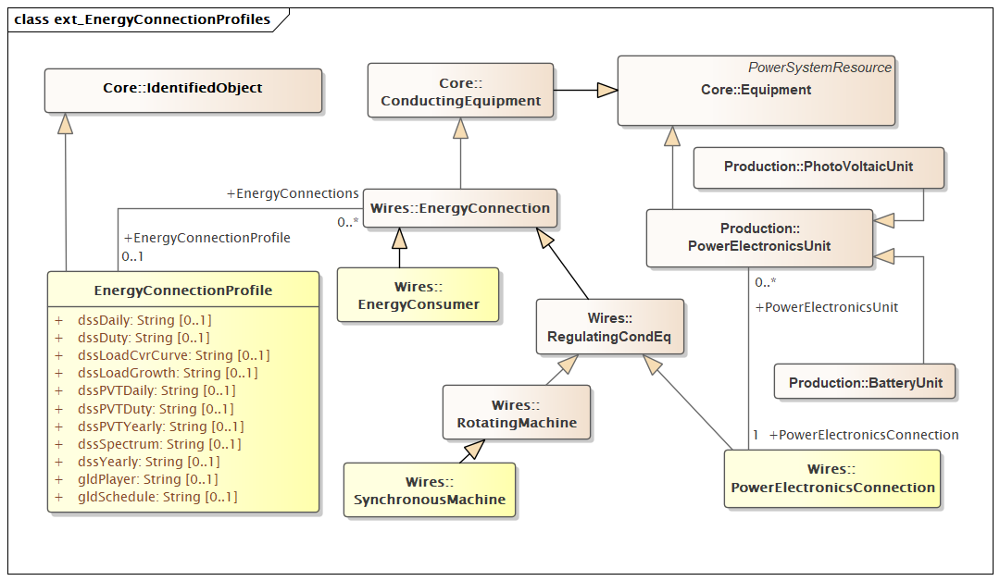

.. _cdpsm:

.. role:: red

This section summarizes the use of a reduced-order CIM [1]_ to support 
feeder modeling for the North American circuits and use cases considered 
in GridAPPS-D.  The full CIM includes over 1100 tables in SQL, each one 
corresponding to a UML class, enumeration or datatype.  RC1 used 
approximately 100 such entities, mapped onto 100+ tables in SQL.  
Subsequent versions of GridAPPS-D use a triple-store database, which is 
better suited for CIM.  

The CIM subset described here is based on CIM100_501-20v1_302CDV20v26_457-20v22, 
which includes new modeling for DER compliant to IEEE 1547-2018, and other changes 
proposed from the GridAPPS-D project.  

Common Information Model Diagrams
=================================

Figure 1 through Figure 20 present the UML class diagrams generated from
Enterprise Architect [2]_. These diagrams provide an essential roadmap
for understanding:

1. How to ingest CIM XML from various sources into the database

2. How to generate native GridLAB-D input files from the database

For those unfamiliar with UML class diagrams:

1. Lines with an arrowhead indicate class inheritance. For example, in
   Figure 1, ACLineSegment inherits from Conductor, ConductingEquipment,
   Equipment and then PowerSystemResource. ACLineSegment inherits all
   attributes and associations from its ancestors (e.g., length), in
   addition to its own attributes and ancestors.

2. Lines with a diamond indicate composition. For example, in Figure 1,
   Substations make up a SubGeographicalRegion, which then
   make up a GeographicRegion.

3. Lines without a terminating symbol are associations. For example, in
   Figure 1, ACLineSegment has (through inheritance) a BaseVoltage,
   Location and one or more Terminals.

4. Italicized names at the top of each class indicate the ancestor (aka
   superclass), in cases where the ancestor does not appear on the
   diagram. For example, in Figure 1, PowerSystemResource inherits from
   IdentifiedObject.

5. In CIMHub, **extension** attributes are prefixed by a *#* symbol. Standard 
   public attributes are prefixed by a *+* symbol.

Please see *CIMHub\_Profile.eap*  [3]_ in the repository [4]_ on GitHub
for the latest updates. The EnterpriseArchitect file includes a
description of each class, attribute and association. It can also
generate HTML documentation of the CIM, with more detail than provided
here.

The diagrammed UML associations have a role and cardinality at each end, 
source and target.  In practice, *only one end of each association* is 
profiled and implemented in SQL.  In some cases, the figure captions 
indicate which end, but see the CIM profile for specific definitions, as 
described in the object diagram section.  Usually, the end with 0..1 
multiplicity is implemented instead of the end with 0..* or 1..* 
multiplicity.  

Network Models in CIMHub
------------------------

Nearly every CIM class inherits from IdentifiedObject, from which we use
two attributes:

1. mRID is the “master identifier” that must be unique and persistent
   among all instances. It’s often used as the RDF resource identifier,
   and is often a GUID.

2. Name is a human-readable identifier that need not be unique.

Figure 1 shows how equipment is organized into a Feeder.  Each piece of 
Equipment has Terminals that connect at ConnectivityNodes, which represent 
the "buses".  Please note that in GridAPPS-D, we do not use 
TopologicalNode at all.  In some CIM use cases, primary for transmission, 
the TopologicalNode coalesces ConnectivityNodes that are connected by 
buswork and closed switches into a single connection point.  Instead, 
substation buswork models need to explicitly include the low-impedance 
branches and switches between ConnectivityNodes.  We assume that modern 
distribution power flow solvers have no need of TopologicalNode.  

|imgcim0|

Figure 1: Placement of ACLineSegment into a Feeder.  In GridAPPS-D, the 
Feeder is the EquipmentContainer for all power system components and the 
ConnectivityNodeContainer for all nodes.  It's energized from a 
Substation, which is part of a SubGeographicalRegion and 
GeographicalRegion for proper context with other CIM models.  For 
visualization, ACLineSegment can be drawn from a sequence of 
PositionPoints associated via Location.  The Terminals are free-standing; 
two of them will “reverse-associate” to the ACLineSegment as 
ConductingEquipment, and each terminal also has one ConnectivityNode.  The 
Terminal:phases attribute is not used; instead, phases will be defined in 
the ConductingEquipment instances.  The associated 
BaseVoltage:nominalVoltage attribute is important for many of the classes 
that don’t have their own rated voltage attributes, for example, 
EnergyConsumer.  

|imgcim1|

Figure 2: There are four different ways to specify ACLineSegment 
impedances.  In all cases, Conductor:length is required.  The first way is 
to specify the individual ACLineSegment attributes, which are sequence 
impedances and admittances, leaving PerLengthImpedance null.  The second 
way is to specify the same attributes on an associated 
PerLengthSequenceImpedance, in which case the ACLineSegment attributes 
should be null.  The third way is to associate a PerLengthPhaseImpedance, 
leaving the ACLineSegment attributes null.  Only conductorCount from 1 to 
3 is supported, and there will be 1, 3 or 6 reverse-associated 
PhaseImpedanceData instances that define the lower triangle of the Z and Y 
matrices per unit length.  The row and column attributes must agree with 
ACLineSegmentPhase:sequenceNumber.  The fourth way to specify impedance is 
by wire/cable and spacing data, by association to WireSpacingInfo and 
WireInfo.  If there 
are ACLineSegmentPhase instances reverse-associated to the ACLineSegment, 
then per-phase modeling applies.  There are several use cases for 
ACLineSegmentPhase: 1) single-phase or two-phase primary, 2) low-voltage 
secondary using phases s1 and s2, 3) associated WireInfo data where the 
WireSpacingInfo association exists, 4) assign specific phases to the 
matrix rows and columns in PerLengthPhaseImpedance.  It is the 
application’s responsibility to propagate phasing through terminals to 
other components, and to identify any miswiring.  (Note: this profile does 
not use WireAssemblyInfo, nor the fromPhase and toPhase attributes of 
PhaseImpedanceData.) 

|imgcim2|

Figure 3: The EnergySource is balanced three-phase, balanced two-phase or 
single-phase Thevenin source.  GridAPPS-D use a three-phase EnergySource 
to represent the transmission system.  See Figures 13-18 for DER modeling.  
The EnergyConsumer is a ZIP load, possibly unbalanced, with an associated 
LoadResponse instance defining the ZIP coefficients.  For three-phase 
delta loads, the phaseConnection is D and the three reverse-associated 
EnergyConsumerPhase instances will have phase=A for the AB load, phase=B 
for the BC load and phase=C for the AC load.  A three-phase wye load may 
have either Y or Yn for the phaseConnection.  Single-phase and two-phase 
loads, including secondary loads, should have phaseConnection=I (for 
individual).  

|imgcim3|

Figure 4: There are eight different kinds of Switch supported in the CIM, 
and all of them have zero impedance.  They would all behave the same in 
power flow analysis, and all would require many more attributes than are 
defined in CIM to support protection analysis.  The use cases for 
SwitchPhase include 1) single-phase, two-phase and secondary switches, 2) 
one or two conductors open in a three-phase switch or 3) transpositions, 
in which case phaseSide1 and phaseSide2 would be different.  RatedCurrent 
may different among the phases, e.g., individual fuses on the same pole 
may have different ratings.  

|imgcim4|

Figure 5: On the left, LinearShuntCompensator and 
LinearShuntCompensatorPhase define capacitor banks, in a way very similar 
to EnergyConsumer in Figure 3.  The kVAR ratings must be converted to 
susceptance based on the nominal voltage, nomU.  Note that aVRDelay is 
really a capacitor control parameter, to be used in conjunction with 
RegulatingControl on the right-hand side.  The RegulatingControl 
associates to the controlled capacitor bank via RegulatingCondEq, and to 
the monitored location via Terminal.  There is no support for a PT or CT 
ratio, so targetDeadband and targetValue have to be in primary volts, 
amps, vars, etc.  Capacitor banks may _respond_ to any of the 
RegulatingControlModeKind choices, but it's not expected that capacitor 
switching will successfully regulate to the targetValue.  

|imgcim5|

Figure 6: PowerTransformers may be modeled with or without tanks, and in 
both cases vectorGroup should be specified according to IEC transformer 
standards (e.g., Dy1 for many substation transformers).  The case without 
tanks is most suitable for balanced three-phase transformers that won’t 
reference catalog data; any other case should use tank-level modeling.  In 
the tankless case, each winding will have a PowerTransformerEnd that 
associates to both a Terminal and a BaseVoltage, and the parent 
PowerTransformer.  The impedance and admittance parameters are defined by 
reverse-associated TransformerMeshImpedance between each pair of windings, 
and a reverse-associated TransformerCoreAdmittance for one winding.  The 
units for these are ohms and siemens based on the winding voltage, rather 
than per-unit.  WindingConnection is similar to PhaseShuntConnectionKind, 
adding Z and Zn for zig-zag connections and A for autotranformers.  If the 
transformer is unbalanced in any way, then TransformerTankEnd is used 
instead of PowerTransformerEnd, and then one or more TransformerTanks may 
be used in the parent PowerTransformer.  Some of the use cases are 1) 
center-tapped secondary, 2) open-delta and 3) EHV transformer banks.  
Tank-level modeling is also required if using catalog data, as described 
with Figure 9.  (TransformerStarImpedance and several PowerTransformer 
attributes are not used.  Star impedance attributes on PowerTransformerEnd 
and magnetic saturation attributes on TransformerEnd are not used.) 

|imgcim6|

Figure 7: A RatioTapChanger can represent a transformer tap changer on the 
associated TransformerEnd.  The RatioTapChanger has some parameters 
defined in a direct-associated TapChangerControl, which inherits from 
RegulatingControl some of the same attributes used in capacitor controls 
(Figure 5).  Therefore, a line voltage regulator in CIM includes a 
PowerTransformer, a RatioTapChanger, and a TapChangerControl.  The CT and 
PT parameters of a voltage regulator can only be described via the 
AssetInfo mechanism, described with Figure 8.  The RegulationControl.mode 
must be voltage.  (Note: RegulationSchedule, RatioTapChangerTable and 
PhaseTapChanger are not used.) 

|imgcim8|

Figure 9: Many distribution software packages use the concept of catalog 
data, aka library data, especially for lines and transformers.  The 
catalog mechanism for transformers will associate a TransformerTank 
(Figure 6) with TransformerTankInfo (here).  Many TransformerTanks can 
share the same TransformerTankInfo data, which saves space and provides 
consistency.It’s important that TransformerEndInfo:endNumber (here) 
properly match the TransformerEnd:endNumber (Figure 6).  The shunt 
admittances are defined by NoLoadTest on a winding / end, usually just one 
such test.  The impedances are defined by a set of ShortCircuitTests; one 
winding / end will be energized, and one or more of the others will be 
grounded in these tests.  (OpenCircuitTest is not used, nor are the 
current, power and voltage attributes of ShortCircuitTest).  

|imgcim9|

Figure 10: The catalog / library mechanism for ACLineSegment will have a 
WireSpacingInfo associated as in Figure 9.  This will indicate whether the 
line is overhead or underground.  phaseWireCount and phaseWireSpacing 
define optional bundling, so these will be 1 and 0 for distribution.  The 
number of phase and neutral conductors is actually defined by the number 
of reverse-associated WirePosition instances.  For example, a three-phase 
line with neutral would have four of them, sequenceNumber from 1 to 4.  
Each WirePosition's phase is determined by the ACLineSegmentPhase with 
matching sequenceNumber, i.e., the phases need not be numbered in any 
particular order.  On the left-hand side, concrete classes 
OverheadWireInfo, TapeShieldCableInfo and ConcentricNeutralCableInfo may 
be associated to ACLineSegmentPhase.  It's the application's 
responsibility to calculate impedances from this data.  In particular, 
soil resistivity and dielectric constants are not included in the CIM.  
Typical dielectric constant values might be defined for each 
WireInsulationKind.  

|imgcim10|

Figure 11: The CIM state variables package was designed to report power 
flow solution values on the distribution system.  It could also report 
state estimator solutions as a special case of power flow solutions.  
Voltages are measured on ConnectivityNodes (i.e., not TopologicalNodes), 
power flows are measured at Terminals into the ConductingEquipment, step 
positions are measured on TapChangers, status is measured on 
ConductingEquipment, and on/off state is measured on ShuntCompensators for 
Switches.  The “injections” have been included here, but there may not 
be a use case for them in distribution.  On the other hand, solution 
values for current are very common in distribution system applications.  
These should be represented as SvPowerFlow values at the solved SvVoltage. 
 
|imgmeas|

Figure 12: Measurements are defined in the Meas package.  They differ from 
the state variables package, in that the values are measured here and not 
calculated or estimated.  Each Measurement is associated to a 
PowerSystemResource, and in GridAPPS-D for now, also a Terminal that 
belongs to the same PowerSystemResource.  (Non-electrical measurements, 
for example weather, would not have the Terminal).  The measurementType is 
a string code from IEC 61850, with PNV, VA, A and POS currently supported.  
The Measurement has a name, mRID, and phases.  In GridAPPS-D, each phase 
is measured individually so multi-phase codes like ABC should not be used.  
Pos measurements will be Discrete, for such things as tap position, switch 
position, or capacitor bank position.  The others will be Analog, with 
magnitude and optional angle in degrees.  Each MeasurementValue will have 
a timeStamp and mRID inherited from IdentifiedObject, so the values can be 
traced.  (Note: IOPoint is a placeholder class with no attributes, 
inherting from IdentifiedObject.  Further, it's acceptable to supply an 
empty or short non-unique name for each MeasurementValue.) 
 
|imginverters|

Figure 13: Power Electronics attributes are the minimum needed to support 
a time series power flow solution.  For simple short-circuit calculations, 
maxIFault is provided as the inverter fault contribution in per-unit of 
rated current.  When PowerElectronicsConnectionPhase is not present, the 
inverter is assumed to be balanced three-phase.  The type of associated 
PowerElectronicsUnit determines whether the inverter is for solar or 
storage (wind is not currently used in GridAPPS-D).  If the inverter 
employs a SmartInverterMode of voltVar, voltWatt or loadFollowing (storage 
only), then a Terminal should be associated through RegulatingControl, 
especially for loadFollowing.  If the inverter will regulate its own 
Terminal, then the explicit Terminal association may not be needed.  
However, there are more attributes needed in CIM to define smart inverter 
functions.  This might be done in harmonization with IEC 61850, which does 
define smart inverter function parameters.  The existing CIM 
RegulatingControl attributes are probably not applicable, so they have 
been hidden in Figure 13.  

|imgmachines|

Figure 14: Rotating Machines are three-phase balanced, either synchronous 
or asynchronous.  The SynchronousMachine ikk attribute and most of the 
AsynchronousMachine attributes are provided to support short-circuit 
calculations according to IEC 60909.  The GeneratingUnit class is needed 
to define minimum and maximum power limits.  In the full CIM, 
GeneratingUnit is an abstract class with descendants HydroUnit, 
ThermalUnit and NuclearUnit, but in GridAPPS-D we don't currently 
distinguish between those types.  If the SynchronousMachine regulates 
voltage, then the RegulatingControl (with attribute values) and Terminal 
associations need to be provided.  

DER Models from IEEE 1547-2018
------------------------------

|imgcim302der|

Figure 15: The DERIEEEType1 class has been added to IEC 61970-302, 2nd 
edition, for describing the dynamics of DER that complies with IEEE Std.  
1547-2018.  This data is used to describe smart inverter functions and 
other DER behavior during time-series power flow in GridAPPS-D.  See IEEE 
1547-2018, IEEE 1547.1-2020, and IEEE P1547.2/D6.2 (Annex F) for 
descriptions of the classes and attributes.  The 302 classes and 
attributes generally map to the interoperability tables in the IEEE 
standards, the main difference being the use of capital letters and 
underscores in the IEEE tables.  Both inverters (Figure 13) and rotating 
machines (Figure 14) can associate to DERIEEEType1 for supplemental 
nameplate and rating information in the network model.  Preliminary values 
for these attributes would be available from an application to 
interconnect DER, and then updated as the project moves through 
commissioning to operational status.  :red:`To be determined whether 
DERDynamics can have cardinality 0..* as shown, or 0..1 like other dynamic 
functions in 302.` 

|imgcim302vq|

Figure 16: DER compliant with IEEE Std. 1547-2018 shall support at least three
control modes for voltage and reactive power. In addition, Category B DER shall
support a fourth mode, WattVar, and an active power control mode, VoltWatt. The
reactive power control modes are mutually exclusive, so only one of those shown
should be enabled, i.e., the unused modes can either be left out of the model, 
or disabled.

|imgcim302misc|

Figure 17: The other settings in IEEE Std. 1547-2018 cover tripping or momentary
cessation during voltage and frequency disturbances, response to frequency 
variations (droop), and power limiting. The parameters in ServiceSettings define
the voltage and frequency range within which the DER is allowed to connect, or to
reconnect after tripping. The settings and modes in this figure are not mutually 
exclusive, but there are ranges of adjustability specified in IEEE Std. 1547-2018.

|imgcim302signal|

Figure 18: Many DER will respond to voltage and frequency and the point of connection,
which would be a Terminal associated to the PowerElectronicsConnection, 
SynchronousMachine, or AsynchronousMachine shown at the top of Figure 15. Where this
is not the case, e.g., the DER responds to voltage and frequency on the other
side of a PowerTransformer, the RemoteInputSignal mechanism can be used as shown
in this figure. In GridAPPS-D, only the voltage signal is relevant. IEEE Std. 1547-2018
states that voltage functions are based on the average, minimum, or maximum of all applicable
voltages. The applicable voltages depend on how the connection appears to the grid,
as conveyed in the attributes of DERIEEEType1. Hence, the RemoteInputSignal.phase
attribute is not used. Instead, use all applicable voltages from the associated Terminal.

Extension for Houses
--------------------

|imghouses|

Figure 19: Houses are used to create 2nd-order thermal models of the 
building envelope, with internal ThermostatController and heating/cooling 
systems.  The purpose is to introduce realistic load stochastic behaviors 
that are independent from and faster-moving than data typically available 
to an electric utility.  To enable repeatable simulations, the House data 
structures have been defined here as a CIM extension.  The House must be 
attached to one EnergyConsumer that incorporates other end-use loads, and 
connects to the distribution system.  The House attributes are the minimum 
necessary to define a GridLAB-D house model, and during simulation, the 
house heating/cooling system will add to the ServicePanel loads.  
Therefore, the application should reduce the nominal value of 
EnergyConsumer.p in order to "make room" for the heating/cooling load that 
will switch on and off, responding to the ThermostatController and the 
weather.  The ThermostatController contains the minimum attributes needed 
for PNNL's double-ramp, double-auction market mechanism.  In the future, 
this will be harmonized with CIM market structures in the 62235 package.  

Extension for Profiles
----------------------

|imgprofiles|

Figure 19a: Optional references to shapes for OpenDSS, and players or 
schedules for GridLAB-D.  

The extension class is EnergyConnectionProfile, each instance of which 
could have many associations to EnergyConsumer, 
PowerElectronicsConnection, or SynchronousMachine as appropriate.  One use 
case is to represent residential loads with the House extension class, and 
commercial spot loads with this extension class.  A Python script will add 
the EnergyConnectionProfile instances, as other scripts presently insert 
houses, DER, and measurements.  Then the CIMHub export function will 
netlist them as appropriate for OpenDSS and GridLAB-D.  

See attribute documentation for applicability.  The shapes, players, and 
schedules are not maintained in CIM, i.e., they must be made available to 
the simulator from an external source.  

- **dssDaily**: Reference to OpenDSS Daily curve, for Load, Storage, PVSystem, Generator, and WindGen power
- **dssDuty**: Reference to OpenDSS Duty Cycle curve, for Load, Storage, PVSystem, Generator, and WindGen power
- **dssLoadCvrCurve**: Reference to OpenDSS CvrCurve, for Load objects
- **dssLoadGrowth**: Reference to OpenDSS Growth curve, for Load objects
- **dssPVTDaily**: Reference to OpenDSS Daily curve, for PVSystem temperature
- **dssPVTDuty**: Reference to OpenDSS Duty Cycle curve, for PVSystem temperature
- **dssPVTYearly**: Reference to OpenDSS Yearly curve, for PVSystem temperature
- **dssSpectrum**: Reference to OpenDSS harmonic current Spectrum, for Load, Storage, PVSystem, Generator, and WindGen power
- **dssYearly**: Reference to OpenDSS Yearly curve, for Load, Storage, PVSystem, Generator, and WindGen power
- **gldPlayer**: GridLAB-D Player for base_power attributes on Load and Triplex_Load objects, real and reactive power for Diesel DG objects, P_Out for Battery objects, and Insolation for Solar objects. Netlisted as player.value.
- **gldSchedule**: GridLAB-D schedule for base_power attributes on Load and Triplex_Load objects, real and reactive power for Diesel DG objects, P_Out for Battery objects, and Insolation for Solar objects.

Extension for Faults
--------------------

|imgfaults|
 
Figure 20: Faults include open conductors and short circuits (optionally 
including ground) on any combination of phases.  In GridAPPS-D, every 
Fault will be an EquipmentFault associated to a Terminal (i.e., we are not 
using LineFault, which requires a lengthFromTerminal1 attribute).  The 
occurredDateTime supports the scripting of fault sequences.  The 
stopDateTime is optional.  If provided, it will be the time at which a 
sustained fault has been repaired.  If not provided, then the fault is 
temporary and will clear itself as soon as it's been deenergized.  

Typical Queries
---------------

These queries focus on requirements of the first volt-var application.

1. Capacitors (Figure 5, Figure 21, Figure 22, Figure 23)

   a. Create a list of capacitors with bus name (Connectivity Node in
      Figure 1), kVAR per phase, control mode, target value and target
      deadband

   b. For a selected capacitor, update the control mode, target value,
      and target deadband

2. Regulators (Figure 7, Figure 8, Figure 21, Figure 38)

   a. List all transformers that have a tap changer attached, along with
      their bus names and kVA sizes

   b. Given a transformer that has a tap changer attached, list or
      update initialDelay, step, subsequentDelay, mode, targetDeadband,
      targetValue, limitVoltage, lineDropCompensation, lineDropR,
      lineDropX, reverseLineDropR and reverseLineDropX

3. Transformers (Figure 6, Figure 9)

   a. Given a bus name or load (Figure 3), find the transformer serving
      it (Figure 25, Figure 28)

   b. Find the substation transformer, defined as the largest
      transformer (by kVA size and or highest voltage rating)

   c. List the transformer catalog (Figure 9, Figure 29) with name,
      highest ratedS, list of winding ratedU in descending order, vector
      group (https://en.wikipedia.org/wiki/Vector\_group used with
      connectionKind and phaseAngleClock), and percent impedance

   d. List the same information as in item c, but for transformers
      (Figure 6) and also retrieving their bus names. Note that a
      transformer can be defined in three ways

      i.   Without tanks, for three-phase, multi-winding, balanced
           transformers (Figure 25 and Figure 26).

      ii.  With tanks along with TransformerTankInfo (Figure 9) from a
           catalog of “transformer codes”, which may describe balanced
           or unbalanced transformers. See Figure 28 and Figure 29.

      iii. With tanks for unbalanced transformers, and
           TransformerTankInfo created on-the-fly. See Figure 28 and
           Figure 29.

   e. Given a transformer (Figure 6), update it to use a different
      catalog entry (TransformerTankInfo in Figure 9)

4. Lines (Figure 2, Figure 10, Figure 21)

   a. List the line and cable catalog entries that meet a minimum
      ratedCurrent and specific WireUsageKind. For cables, be able to
      specify tape shield vs. concentric neutral, the
      WireInsulationKind, and a minimum insulationThickness. (Figure 36)

   b. Given a line segment (Figure 2) update to use a different linecode
      (Figure 10, Figure 35)

   c. Given a bus name, list the ACLineSegments connected to the bus,
      along with the length, total r, total x, and phases used. There
      are four cases as noted in the caption of Figure 2, and see Figure
      32 through Figure 35.

   d. Given a bus name, list the set of ACLineSegments (or
      PowerTransformers and Switches) completing a path from it back to
      the EnergySource (Figure 3). Normally, the applications have to
      build a graph structure in memory to do this, so it would be very
      helpful if a graph/semantic database can do this.

5. Voltage and other measurements (Figure 1, Figure 11)

   a. Given a bus, attach a voltage solution point (SvVoltage, Figure
      39)

   b. List all voltage solution points and their buses, and for each
      bus, list the phases actually present

   c. For tap changer position (SvTapStep, Figure 40), attach and list
      values as in items a and b

   d. For capacitor switch status (SvShuntCompensatorSections, Figure
      41), attach and list values as in items a and b

6. Loads (Figure 3, Figure 37)

   a. Given a bus name, list and total all of the loads connected by
      phase, showing the total p and q, and the composite ZIP
      coefficients

7. Switching (Figure 4, Figure 31)

   a. Given a bus name, trace back to the EnergySource and list the
      switches encountered, grouped by type (i.e. the leaf class in
      Figure 4). Also include the ratedCurrent, breakingCapacity if
      applicable, and open/close status. If SwitchPhase is used, show
      the phasing on each side and the open/close status of each phase.

   b. Given switch, toggle its open/close status.

Object Diagrams for Queries
---------------------------

This section contains UML object diagrams for the purpose of
illustrating how to perform typical queries and updates. For those
unfamiliar with UML object diagrams:

1. Each object will be an instance of a class, and more than one
   instance of a class can appear on the diagram. For example, Figure 21
   shows two ConnectivityNode instances, one for each end of a
   ConductingEquipment.

2. The object name (if specified and important) appears before the colon
   (:) above the line, while the UML class appears after the colon.
   Every object in CIM will have a unique ID, and a name (not
   necessarily unique), even if not shown here.

3. Some objects may be shown with run-time state below the line. These
   are attribute value assignments, drawn from those available in the
   UML class or one of the class ancestors. The object may have more
   attribute assignments, but only those directly relevant to the figure
   captions are shown in the diagrams of this section.

4. Object associations are shown with solid lines, role names, and
   multiplicities similar to the UML class diagrams. One important
   difference is that only one way of navigating a particular
   association will be defined in the profile. For example, the lower
   left corner of Figure 1 shows a two-way link between Terminal
   and ConnectivityNode in the UML class diagram. However, Figure 21
   shows that only one direction has been defined in the profile. Each
   Terminal has a direct reference to its corresponding
   ConnectivityNode. In order to navigate the reverse direction from
   ConnectivityNode to Terminal, some type of conditional query
   would be required. In other words, the object diagrams in this
   section indicate which associations can actually be used in
   GridAPPS-D.

5. In some cases, the multiplicities on the object diagrams are more
   restrictive than on the class diagrams, due to profiling. For
   example, EnergyConsumer and ShuntCompensator must have exactly one Terminal, not 1..*.

The object diagrams are intended to help you break down the CIM queries
into common sub-tasks. For example, query #1 works with capacitors. It’s
always possible to select a capacitor (aka LinearShuntCompensator) by
name. In order to find the capacitor at a bus, say “bus1” in Figure 12,
one would retrieve all Terminals having a ConnectivityNode reference to
“bus1”. Each of those Terminals will have a ConductingEquipment
reference, and you want the Terminal(s) for which that reference is
actually a LinearShuntCompensator. In this CIM profile, only leaf
classes (e.g. LinearShuntCompensator) will be instantiated, never base
classes like ConductingEquipment. There can be more than one capacitor
at a bus, more than one load, more than one line, etc.

|imgcim11|

Figure 21: In order to traverse buses and components, begin with a 
ConnectivityNode (left).  Collect all terminals referencing that 
ConnectivityNode; each Terminal will have one-to-one association with 
ConductingEquipment, of which there are many subclasses.  In this example, 
the ConductingEquipment has a second terminal referencing the 
ConnectivityNode called bus2.  There are applications for both Depth-First 
Search (DFS) and Bread-First Search (BFS) traversals.  Note 1: the 
Terminals have names, but these are not useful.  In some cases, the 
Terminal sequenceNumber attribute is needed to clearly identify ends of a 
switch.  Note 2: in earlier versions of GridAPPS-D, we had one-to-one 
association of TopologicalNode and ConnectivityNode, but these are no 
longer necessary.  Note 3: transformers are subclasses of 
ConductingEquipment, but we traverse connectivity via transformer ends 
(aka windings).  This is illustrated later.  

In order to find capacitors (or anything else) associated with a 
particular “feeder”, Figure 22 shows that you would query for objects 
having EquipmentContainer reference to the Feeder object.  In GridAPPS-D, 
we only use Feeder for equipment container in CIM, and this would 
correspond to one entire GridLAB-D model.  There is also a BaseVoltage 
reference that will have the system nominal voltage for the capacitor’s 
location.  However, in order to work with equipment ratings you should use 
ratedS and ratedU attributes where they exist, particularly for capacitors 
and transformers.  These attributes are often slightly different than the 
“system voltage”.  Most of the attribute units in CIM are SI, with a 
few exceptions like percent and kW values on transformer test sheets 
(i.e., CIM represents the test sheet, not the equipment).  

|imgcim12|

Figure 22: All conducting equipment lies within an EquipmentContainer,
which in GridAPPS-D, will be a Feeder object named after the feeder. It
also has reference to a BaseVoltage, which is typically one of the ANSI
preferred system voltages. Power transformers are a little different, in
that each winding (called “end” in CIM) has reference to a BaseVoltage.
Note that equipment ratings come from the vendor, and in this case
ratedU is slightly different from nominalVoltage. All conducting
equipment has a Location, which contains XY coordinates (see Figure 1).
The Location is useful for visualization, but is not essential for a
power flow model.

Completing the discussion of capacitors, Figure 23 provides two examples
for single-phase, and three-phase with local voltage control. As shunt
elements, capacitors have only one Terminal instance. Loads and sources
have one terminal, lines and switches have two terminals, and
transformers have two or more terminals. Examples of all those are shown
later. In Figure 23, the capacitor’s kVAR rating will be based on its
nameplate ratedU, not the system’s nominalVoltage.

Often, the question will arise “what phases exist at this bus?”.There 
is no phasing explicitly associated with a ConnectivityNode, and we don't 
use the Terminal phases attribute in preference to the "wires phase model" 
classes.  For example, thephases at a line segment terminal can always be 
obtained from the ACLineSegmentPhase instances.  To answer the question 
about bus phasing, we’d have to query for all ConductingEquipment 
instances having Terminals connected to that bus, as in Figure 21.  The 
types of ConductingEquipment that may have individual phases include 
LinearShuntCompensators (Figure 23), ACLineSegments, PowerTransformers 
(via TransformerEnds), EnergyConsumers, EnergySources, 
PowerElectronicsConnections, and descendants of Switch.  If the 
ConductingEquipment has such individual phases, then add those phases to 
list of phases existing at the bus.  If there are no individual phases, 
then ABC all exist at the bus.  Note this doesn’t guarantee that all 
wiring to the bus is correct; for example, you could still have a 
three-phase load served by only a two-phase line, which would be a 
modeling error.  In Figure 23, we’d find phase C at Bus611 and phases 
ABC at Bus675.  Elsewhere in the model, there should be ACLineSegments, 
PowerTransformers or Switch descendants delivering phase C to Bus611, all 
three phases ABC to Bus675.  

|imgcim13|

Figure 23: Capacitors are called LinearShuntCompensator in CIM. On the
left, a 100 kVAR, 2400 V single-phase bank is shown on phase C at bus
611. bPerSection = 100e3 / 2400^2 [S], and the bPerSection on
LinearShuntCompensatorPhase predominates; these values can differ among
phases if there is more than one phase present. On the right, a balanced
three-phase capacitor is shown at bus 675, rated 300 kVAR and 4160 V
line-to-line. We know it’s balanced three phase from the absence of
associated LinearShuntCompensatorPhase objects. bPerSection = 300e4 /
4160^2 [S]. This three-phase bank has a voltage controller attached with
2400 V setpoint and 240 V deadband, meaning the capacitor switches ON if
the voltage drops below 2280 V and OFF if the voltage rises above 2520
V. These voltages have to be monitored line-to-neutral in CIM, with no
VT ratio. In this case, the control monitors the same Terminal that the
capacitor is connected to, but a different conducting equipment’s
Terminal could be used. The control delay is called aVRDelay in CIM, and
it’s an attribute of the LinearShuntCompensator instead of the
RegulatingControl. It corresponds to “dwell time” in GridLAB-D.

Figure 24 through Figure 30 illustrate the transformer query tasks, plus 
Figure 38 for attached voltage regulators.  The autotransformer example is 
rated 500/345/13.8 kV and 500/500/50 MVA, for a transmission system.  The 
short circuit test values are Z\ :sub:`HL`\ =10%, Z\ :sub:`HT`\ =25% and 
Z\ :sub:`LT`\ =30%.  The no-load test values are 0.05% exciting current 
and 0.025% no-load losses.  These convert to r, x, g and b in SI units, 
from Z\ :sub:`LT`\ = U\ :sub:`rated`\ * U\ :sub:`rated`\ / S\ 
:sub:`rated`\, where S\ :sub:`rated`\ and U\ :sub:`rated`\ are based on 
the “from” winding (aka end).  The same base quantities would be used 
to convert r, x, g and b back to per-unit or percent.  The open wye – 
open delta impedances are already represented in percent or kW, from the 
test reports.  

|imgcim14|

Figure 24: Autotransformer with delta tertiary winding acts like a
wye-wye transformer with smaller delta tertiary. The vector group would
be Yynd1 or Yyd1. For analyses other than power flow, it can be
represented more accurately as the physical series (n1) – common (n2)
connection, with a vector group Yand1. In either case, it’s a
three-winding transformer.

|imgcim15|

Figure 25: A three-winding autotransformer is represented in CIM as a 
PowerTransformer with three PowerTransformerEnds, because it’s balanced 
and three-phase.  The three Terminals have direct ConductingEquipment 
references to the PowerTransformer, so you can find it from bus1, busX or 
busY.  However, each PowerTransformerEnd has a back-reference to the same 
Terminal, and it’s own reference to BaseVoltage (Figure 13); that’s 
how you link the matching buses and windings, which must have compatible 
voltages.  Terminals have a sequenceNumber, but the PowerTransformerEnd's 
endNumber is what establishes correct linkage to catalog data as discussed 
later.  By convention, ends with highest ratedU have the lowest endNumber, 
and endNumber establishes that end’s place in the vectorGroup.  

|imgcim16|

Figure 26: Power transformer impedances correspond to the three-winding
autotransformer example of Figure 24 and Figure 25. There are three
instances of TransformerMeshImpedance connected pair-wise between the
three windings / ends. The x and r values are in Ohms referred to the
end with highest ratedU in that pair. There is just one
TransformerCoreAdmittance, usually attached to the end with lowest
ratedU, and the attribute values are Siemens referred to that end’s
ratedU.

|imgcim17|

Figure 27: Open wye - open delta transformer banks are used to provide 
inexpensive three-phase service to loads, by using only two single-phase 
transformers.  This is an unbalanced transformer, and as such it requires 
tank modeling in CIM.  Physically, the two transformers would be in 
separate tanks.  Note that Tank A is similar to the residential 
center-tapped secondary transformer, except the CIM phases for the 
secondary would include s1 and s2 instead of A and B.  

|imgcim18|

Figure 28: Unbalanced PowerTransformer instances comprise one or more
TransformerTanks, which own the TransformerTankEnds. Through the ends,
wdgHi collects phases ABN and busLo collects phases ABCN. Typically,
phase C will also exist at wdgHi, but this transformer doesn’t require
it. We still assign vectorGroup Yd1 to the supervising PowerTransformer,
as this is the typical case. The modeler should determine that. By
comparison to Figure 27, there is a possible ambiguity in how endA3
represents the polarity dot at the neutral end of Wdg A3. This is the
purpose of TransformerTankEnd.reversed, which should be True for wdgA3.

|imgcim19|

Figure 29: This Asset catalog example defines the impedances for Tank B of 
the open wye – open delta bank.  This is a 50 kVA, 7200 / 240 V 
single-phase transformer.  It has 1% exciting current and 0.4 kW loss in 
the no-load test, plus 2.1% reactance and 0.5 kW loss in the short-circuit 
test.  A multi-winding transformer could have more than one grounded end 
in a short-circuit test, but this is not common.  The catalog data is 
linked with an AssetDataSheet association shown to the left.  Furthermore, 
endNumber on the TransformerEndInfo has to match endNumber on the 
TransformerTankEnd instances associated to Tank B.  Instead of catalog 
information, we could have used mesh impedance and core admittance as in 
Figure 21, but we’d have to convert the test sheets to SI units and we 
could not share data with other TransformerTank instances, both of which 
are inconvenient.  

Figure 30 through Figure 36 illustrate the query tasks for
ACLineSegments and Switches, which will define most of the circuit’s
connectivity. The example sequence impedances were based on Z\ :sub:`1`
= 0.1 + j0.8 Ω/mile and Z\ :sub:`0` = 0.5 + j2.0 Ω /mile. For
distribution systems, use of the shared catalog data is more common,
either pre-calculated matrix (Figure 34) or spacing and conductor
(Figure 35 and Figure 36). In both cases, impedance calculation is
outside the scope of CIM (e.g. GridLAB-D internally calculates line
impedance from spacing and conductor data).

|imgcim20|

Figure 30: An ACLineSegment with two phases, A and C. If there are no
ACLineSegmentPhase instances that associate to it, assume it’s a
three-phase ACLineSegment. This adds phases AC to bus671 and bus684.

|imgcim21|

Figure 31: This 50-Amp load break switch connects phases AC between 
busLeft and busRight.  Without associated SwitchPhase instances, it would 
be a three-phase switch.  This switch also transposes the phases; A on 
side 1 connects with C on side 2, while C on side 1 connects with A on 
side 2.  This is the only way of transposing phases in CIM.  Note the 
Terminal.sequenceNumber is essential to differentiate phaseSide1 from 
phaseSide2.  Also note that LoadBreakSwitch has the open attribute 
inherited from Switch, while SwitchPhase has the converse closed 
attribute.  In order to open and close the switch, these attributes would 
be toggled appropriately.  See Figure 4 for other types of switch.  

|imgcim22|

Figure 32: This is a balanced three-phase ACLineSegment between bus632
and bus671, 2000 feet or 609.6 m long. Sequence impedances are specified
in ohms, as attributes on the ACLineSegment. This is a typical pattern
for transmission lines, but not distribution lines.

|imgcim23|

Figure 33: The impedances from Figure 27 were divided by 609.6 m, to
obtain ohms per meter for seqCat1. Utilities often call this a “line
code”, and other ACLineSegment instances can share the same
PerLengthImpedance. A model imported into the CIM could have many line
codes, not all of them used in that particular model. However, those
line codes should be available for updates by reassigning
PerLengthImpedance.

|imgcim24|

Figure 34: This is a two-phase line segment from bus671 to bus684 using a 
line code, which has been specified using a 2x2 symmetric matrix of phase 
impedances per meter, instead of sequence impedances per meter.  This is 
more common for distribution than either Figure 32 or Figure 33.  It’s 
distinguished from Figure 33 by the fact that PerLengthImpedance 
references an instance of PerLengthPhaseImpedance, not 
PerLengthSequenceImpedance.  The conductorCount attribute tells us it’s 
a 2x2 matrix, which will have two unique diagonal elements and one 
distinct off-diagonal element.  The elements are provided in three 
PhaseImpedanceData instances, which are named here for clarity as Z11, Z12 
and Z22.  However, only the row and column attributes are meaningful to 
identify the matrix element.  In this example, Z11 and Z22 are slightly 
different.  In order to swap phases A and C, we would swap the 
sequenceNumber values on the ACLineSegmentPhase instaces.  As presented 
here, mtx604 can apply to phasing AB, BC or AC.  

|imgcim25|

Figure 35: The two-phase ACLineSegment impedance defined by sharing wire 
and spacing data from a catalog.  Each ACLineSegmentPhase links to an 
OverheadWireInfo instance via the AssetDataSheet association.  If the 
neutral (N) is present, we have to specify its wire information for a 
correct impedance calculation.  In this case, ACN all use the same wire 
type, but they can be different, especially for the neutral.  Similarly, 
the WireSpacingInfo associates to the ACLineSegment itself via a 
AssetDataSheet assocation.  

|imgcim26|

Figure 36: The upper five instances define catalog attributes for Figure 
30.  The WirePosition xCoord and yCoord units are meters, not feet, and 
they include sequenceNumber assignments to match ACLineSegmentPhase 
sequenceNumbers.  The phaseWireSpacing and phaseWireCount attributes are 
for sub-conductor bundling on EHV and UHV transmission lines; bundling is 
not used on distribution.  The number of WirePositions that reference 
spc505acn determine how many wires need to be assigned.  Eliminating the 
neutral, this would produce a 2x2 phase impedance matrix.  Although the 
pattern appears general enough to support multiple neutrals and 
transmission overbuild, the CIM doesn’t actually have the required 
phasing codes.  When isCable is true, the WirePosition yCoord values would 
be negative for underground depth.  To find overhead wires of a certain 
size or ampacity, we can put query conditions on the ratedCurrent 
attribute.  To find underground conductors, we query the 
ConcentricNeutralCableInfo or TapeShieldCableInfo instead of 
OverheadWireInfo.  All three inherit the ratedCurrent attribute from 
WireInfo.  Cables don’t yet have a voltage rating in CIM AssetInfo, but 
you can use insulationThickness as a proxy for voltage rating in queries.  
Here, 5.588 mm corresponds to 220 mils, which is a common size for 
distribution.  

Figure 37 illustrates the loads, which are called EnergyConsumer in CIM.
The houses and appliances from GridLAB-D are not supported in CIM. Only
ZIP loads can be represented. Further, any load schedules would have to
be defined outside of CIM. Assume that the CIM loads are peak values.

Figure 38 illustrates the voltage regulator function. Note that
GridLAB-D combines the regulator and transformer functions, while CIM
separates them. Also, the CIM provides voltage and current transducer
ratios for tap changer controls, but not for capacitor controls.

Figure 39 through Figure 41 illustrate how solved values can be attached 
to buses or other components.  

|imgcim27|

Figure 37: The three-phase load (aka EnergyConsumer) on bus671 is balanced 
and connected in delta.  It has no ratedU attribute, so use the referenced 
BaseVoltage (Figure 22) if a voltage level is required.  On the right, a 
three-phase wye-connected unbalanced load on bus675 is indicated by the 
presence of three EnergyConsumerPhase instances referencing 
UnbalancedLoad.  For consistency in searches and visualization, 
UnbalancedLoad.p should be the sum of the three phase values, and likewise 
for UnbalancedLoad.q.  In power flow solutions, the individual phase 
values would be used.  Both loads share the same LoadResponse instance, 
which defines a constant power characteristic for both P and Q, because 
the percentages for constant impedance and constant current are all zero.  
The two other most commonly used LoadResponseCharacteristics have 100% 
constant current, and 100% constant impedance.  Any combination can be 
used, and the units don’t have to be percent (i.e., use a summation to 
determine the denominator for normalization).  

|imgcim28|

Figure 38: In CIM, the voltage regulator function is separated from the 
tap-changing transformer.  The IEEE 13-bus system has a bank of three 
independent single-phase regulators at busRG60, and this example shows a 
RatioTapChanger attached to the regulator on phase A, represented by the 
TransformerTankEnd having phases=A or phases=AN.  See Figure 28 for a more 
complete picture of TransformerTankEnds, or Figure 25 for a more complete 
picture of PowerTransformerEnds.  Either one can be the TransformerEnd in 
this figure, but with a PowerTransformerEnd, all three phase taps would 
change in unison (i.e.  they are “ganged”).  Most regulator attributes 
of interest are found in RatioTapChanger or TapChangerControl instances.  
However, we need the AssetDataSheet mechanism to specify ctRatio, ptRatio 
and ctRating values.  These are inherent to the equipment, whereas the 
attributes of RatioTapChanger and TapChangerControl are all settings per 
instance.  For the IEEE 13-bus example, there would be separate 
RatioTapChanger and TapChangerControl instances for phases B and C.  

|imgcim29|

Figure 39: In this profile, a solved voltage value attaches to 
ConnectivityNode in GridAPPS-D.  Positive sequence or phase A is implied, 
unless the phase attribute is specified.  

|imgcim30|

Figure 40: SvTapStep links to a TransformerEnd indirectly, through the
RatioTapChanger. There is no phasing ambiguity because
TransformerTankEnd has its phases attribute, while PowerTransformerEnd
always includes ABC. Units for SvTapStep.position are per-unit.

|imgcim31|

Figure 41: The on/off value for a capacitor bank attaches directly to 
LinearShuntCompensator.  If the phase attribute is not specified, then 
this value applies to all phases.
  
Interoperability Testing
------------------------
  
CIMHub participated in EPRI's Grid Model Data Management (GMDM) project,
through the CIM Interoperability Tests in Charlotte, NC, June 14-16, 2022.
We passed power flow tests with the reference model, and imported planning model
assemblies provided by four (out of four attempted) other vendors.

The GMDM CIM profile included some experimental features, and some other
choices that differed from CIMHub design choices. In preparation for this
test, we adopted some experimental features that are not in standard CIM:

- Removed the leading underscore from *mRID* so it matches ``rdf:about``.
  The UML documentation is arguably not clear, but the CIM standard appears 
  to be moving in this direction.
- Adopted the *OrderdPhases* attribute for *TransformerTankEnd*. This attribute
  removed ambiguity from complicated transformer connections. It should be adopted 
  for *TransformerTankEnd*, *EnergyConsumerPhase*, *PowerElectronicsConnectionPhase*,
  and possibly others.

We did not make other changes to the internal CIMHub model for this GMDM test.
Instead, the incoming GMDM files were converted to a CIMHub schema:

- ``./gmdm/adapt_gmdm.py`` implemented the first pass, outside of Blazegraph

  - Combines incoming XML files from the GMDM planning assembly
  - Merges the incoming namespaces into ``http://iec.ch/TC57/CIM100#``
  - Converts kV to volts, and MVA to VA
  - Converts the experimental *WireAssembly* to *WireSpacingInfo*
  - Correct the spelling of *PhotoVoltaicUnit* to *PhotovoltaicUnit*
  - Swap *EquipmentContainer* and *AdditionalEquipmentContainer*, because the incoming
    GMDM files assign *EquipmentContainer* to the *Substation* while CIMHub assigns
    it to the *Feeder*. The priority is not clear in CIM UML.
  - Produced ``adapted.xml``, which was loaded into Blazegraph

- ``./gmdm/step2.py`` implemented the second pass using SPARQL and Blazegraph

  - Make sure *EquipmentContainer* is the feeder for *Breaker*, *PowerTransformer*, *EnergySource*, which are inside the *Substation* for GMDM.
  - Populate *LinearShuntCompensator.sections* and *bPerSection* from phases
  - Populate *Switch.ratedCurrent* and *Switch.normalOpen* from phases on *Breaker*, *Fuse*, *LoadBreakSwitch*, *Recloser*
  - Put a base voltage on *Breaker* and *EnergySource*
  - Populate *RegulatingControl.enabled* as true
  - Populate *RatioTapChanger.normalStep* as 0
  - Populate *RatioTapChanger.TransformerEnd* from *TransformerEnd.RatioTapChanger*, i.e., reversing an association
  - Populate *RegulatingControl.RegulatingCondEq* from *RegulatingCondEq.RegulatingControl*, i.e., reversing an association
  - Implement *targetValueUnitMultiplier* on *targetValue* and *targetDeadband* for *TapChangerControl* and *RegulatingControl*. 
    Supported values are ``none`` or ``k``.
  - Convert the GMDM wind, solar, and storage units into a single virtual battery [5]_, [6]_ behind the *PowerElectronicsConnection*.
    Neither OpenDSS nor GridLAB-D can represent multiple units connected to the DC side of an inverter.

CIMHub may differ from other CIM implementations in these respects:

- We use *IdentifiedObject.mRID* as a database key.
- We combine incoming CIM XML files into a single XML file with a single namespace.
- We do not employ the CIM unit and multiplier system. Instead, all internal physical units are SI.
  Multipliers can still be implemented with *e3* and *e6* in attribute values; the base units are still SI to CIMHub.
- We use the CIM Dynamics package to represent DER control functions as defined in IEEE 1547-2018.
  (This implementation did not play a role in the GMDM test).
- We prefer to represent a single-phase, center-tap service transformer with 3 windings, and *s1s2* phasing. This
  allows unbalanced loading on the secondary, which becomes significant at faster measurement data rates. The CIM
  also supports a simplified single-phase service transformer [7]_, which would be used with *ABC* phasing on 
  the secondary side. This may be more convenient for tracing meter associations to primary phases within the CIM.
  With *s1s2* secondary phasing, the application would have to perform such tracing.

CIMHub has not implemented an export to CIM. The CIM export command in OpenDSS uses the CIMHub profile, which
does not match GMDM and may not match other profiles. Any future support of CIM import and export should use
the adapter approach we used for the GMDM tests.  This will insulate CIMHub's internal schema from changes,
including experimental proposals, that may be found in other profiles.

Other CIM Topics
----------------

Metering Relationship to Loads in the CIM
^^^^^^^^^^^^^^^^^^^^^^^^^^^^^^^^^^^^^^^^^

Figure 42 shows how emulated trouble calls will be connected to loads 
(EnergyConsumers) for test scenarios.  The TroubleTicket is associated 
with Customer, CustomerAgreement and UsagePoint, which can then be 
associated to Equipment or any of its descendants.  Figure 42 shows the 
linkage to EnergyConsumer or EnergySource, but it can also be linked to 
RegulatingCondEq (e.g., rotating machine and inverter-based DER).  There 
are many attributes of Customer, CustomerAgreement and UsagePoint that are 
not yet used in GridAPPS-D, and not shown in Figure 43.  These would be 
important for future metering and customer management applications.  For 
now, the only TroubleTicket attributes to be used are dateTimeOfReport, 
resolvedDateTime and troubleKind.  The PNNLTroubleCallKind was added 
because the existing troubleCode attribute is a non-standardized String.  
However, the comment attribute could be used for optional comments on 
each TroubleTicket.  

|imgcim33|

Figure 42: Trouble Calls route through Metering Usage Points to EnergyConsumers

CIM Enhancements to be Proposed
^^^^^^^^^^^^^^^^^^^^^^^^^^^^^^^

Possible CIM enhancements: 

1. Different on and off delay parameters for RegulatingControl (Figure
   5)

2. Current ratings for PerLengthImpedance (Figure 2). At present, some
   users rely on associated WireInfo, ignoring all attributes except
   currentRating.

3. Transducers for RegulatingControl (Figure 5)

4. Dielectric constant and soil resistivity (Figure 10)

5. Add the Fault.stopDateTime attribute

6. Single-phase asynchronous and synchronous machines.

.. [1]
   See http://cimug.ucaiug.org/default.aspx and the EPRI CIM Primer at:
   http://www.epri.com/abstracts/Pages/ProductAbstract.aspx?ProductId=000000003002006001

.. [2]
   Suggest “Corporate Edition” from http://www.sparxsystems.com/ for
   working with CIM UML. The free CIMTool is still available at
   http://wiki.cimtool.org/index.h tml, but support is being phased out.

.. [3]
   https://github.com/GRIDAPPSD/CIMHub

.. [4]
   https://github.com/GRIDAPPSD/CIMHub

.. [5]
   Wang, Bhattarai, Lian, Hammerstrom, and Ma, *A Unified Virtual Battery Model for Responsive Assets*, https://doi.org/10.1109/PESGM40551.2019.8974107

.. [6]
   Chicco, Riaz, Mazza, and Mancarrella, *Flexibility From Distributed Multienergy Systems*, https://doi.org/10.1109/JPROC.2020.2986378

.. [7]
   Peppanen, Rocha, Taylor, and Dugan, *Secondary Low-Voltage Circuit Models – How Good is Good Enough?*, https://doi.org/10.1109/TIA.2017.2764024

.. |imgcim9| image:: media/cim_DCIMWireInfo.png

.. |imgcim12| image:: media/cim_ConductingEquipmentContexts.png

.. |imgcim302der| image:: media/cim_302_IEEE1547GridAPPSD.png
.. |imgcim302vq| image:: media/cim_302_VoltageControlGridAPPSD.png

