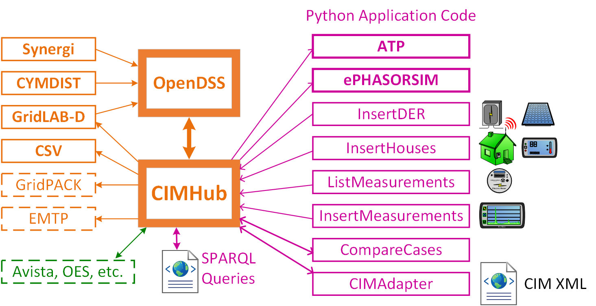

.. role:: math(raw)
   :format: html latex
..

Overview
========

CIMHub provides network model translation, with two major components
indicated by heavy orange blocks in the diagram below. OpenDSS plays a 
central role; it creates most of our CIM XML files using its ``Export CIM100`` 
command. There are other ways to obtain CIM XML files, indicated by blocks 
on the left side. The other heavy orange block is a Java program that
exports models from CIM XML to other formats.

Most of the user application code is written in Python or SPARQL text,
indicated with purple blocks and labels to the right side. Some utilities 
and tool vendors have also interfaced with CIMHub, indicated by the green block.

CIMHub participated in an interoperability test at EPRI Charlotte in June, 2022.
The ``CIMAdapter.py`` script was used in that test, and will be used in future
model exchanges between CIMHub and other versions or profiles of CIM.

