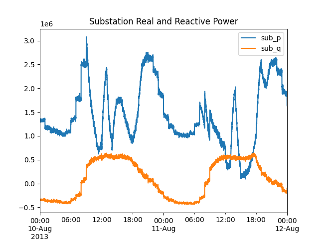

.. role:: math(raw)
   :format: html latex
..

Tutorial
========

This tutorial is presented for Windows. You may also run it on Linux
or Mac OS, using ``*.sh`` files instead of ``*.bat`` files, and
possibly ``python3`` instead of ``python``.  We will go through the
process of converting the IEEE 123-bus test system through CIM to
both GridLAB-D and OpenDSS, comparing power flow solutions in both
solvers. Then we will add houses and solar generation to the model,
so we can impute feeder measurements from GridLAB-D simulations with
weather data from Austin, TX.

IEEE 123-Bus Base Case
----------------------

In this first step, we run power flow in OpenDSS from a local copy
of the IEEE test case and export the CIM XML. This XML file is uploaded
to Blazegraph and then we export OpenDSS and GridLAB-D models from CIM.
Power flow solutions from these two exported models are compared to the 
first one. At the end of this step, the CIM XML remains in Blazegraph.

- From a command prompt in ``c:\\blazegraph``, invoke ``go.bat``. This
  starts the database engine. Leave this command prompt open, and don't
  worry about any Java exceptions that are caught. When done with the tutorial,
  you can use ``Ctrl-C`` to stop the database engine, then close the
  command prompt.
- Open a second command prompt, navigate to ``./Tutorial`` in the CIMHub
  repository, and invoke ``python base123.py``
- If everything goes well, you should see...

.. literalinclude:: ../tutorial/base123.py
  :language: Python
  :linenos:

SPARQL Introduction
-------------------

Show the UML and SPARQL query in Python to list the feeders.

Augmenting the Feeder with DER
------------------------------

With the base CIM XML still in Blazegraph, we will run a script that augments
the base case with DER and houses:

- From a command prompt in ``./Tutorial`` in the CIMHub repository,
  invoke ``python augment123.py``
- If everything goes well, you should see 287 Houses and 14 PowerElectronicsConnections
  in the summary of database contents. 

Document the file format to specify DER.

.. literalinclude:: ../tutorial/ieee123_der.dat
  :linenos:

Augmenting the Feeder with Houses
---------------------------------

Reference the ETP model paper. Describe how houses are used.

.. literalinclude:: ../tutorial/augment123.py
  :language: Python
  :linenos:

The Role of mRIDs
-----------------

Reference the RFC and the OpenDSS technical note. Point out how the DER and House
mRIDs are persisted.

Impute Data with Houses and DER
-------------------------------

Re-export the GridLAB-D model with houses and DER, run a validation case.
Add collectors and climate to the wrapper file, run a daily simulation.
Plot each solar output and the aggregate feeder quantities.

- From a command prompt, navigate to ``./Tutorial`` in the CIMHub repository.
- Invoke ``gridlabd climate_run.glm``. This takes a few minutes to run a two-day simulation, 
  at 3-second time steps.  Nearly 100 comma-separated value (CSV) files will be created.
- Invoke ``python combine_recorders.py``.  This takes several minutes to load the CSV
  files into a Pandas dataframe, and save the 3-second data into an HDF5 file. (Ignore
  the warnings about time zone format; this will be fixed on https://github.com/gridlab-d/gridlab-d/issues/1363)
- Invoke ``python plot_hdf5.py``. This will create several plots of the 3-second data,
  as shown below. It also re-samples the data at 15-minute intervals, and exports
  that data to ``aug11slow.hdf5`` and ``aug11slow.csv``

.. literalinclude:: ../tutorial/climate_run.glm
  :linenos:
  :lines: 1-54

.. image:: ../tutorial/weather.png

.. image:: ../tutorial/feeder.png

.. image:: ../tutorial/components.png

.. image:: ../tutorial/transformers.png

.. image:: ../tutorial/components15min.png

.. image:: ../tutorial/transformers15min.png

Creating an Opal-RT (ePHASORSIM) Model
--------------------------------------

First add ePHASORSIM to the Python module. Point out the SPARQL XML file.

