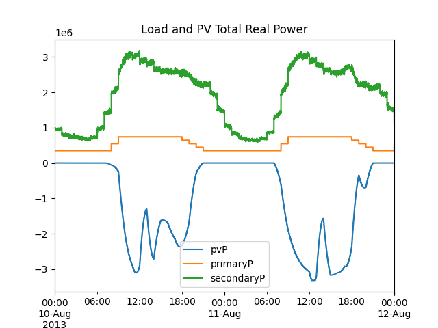
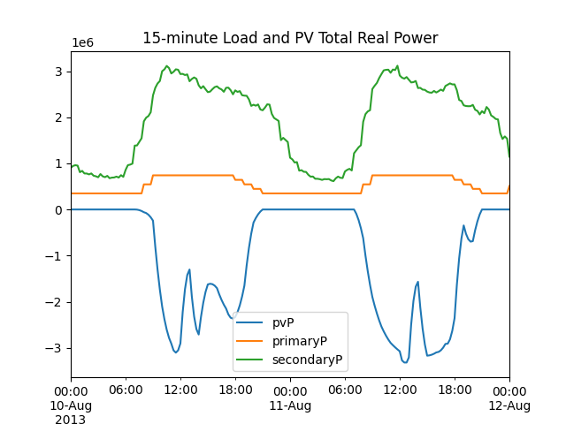
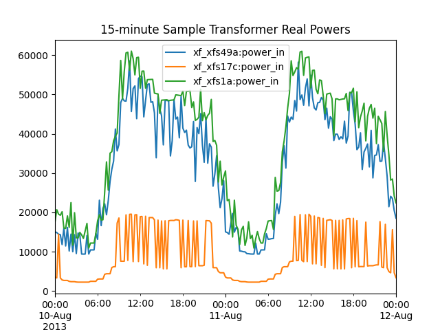

.. role:: math(raw)
   :format: html latex
..

Tutorial
========

This tutorial is presented for Windows. You may also run it on Linux
or Mac OS, using ``*.sh`` files instead of ``*.bat`` files, and
possibly ``python3`` instead of ``python``.  We will go through the
process of converting the IEEE 123-bus test system through CIM to
both GridLAB-D and OpenDSS, comparing power flow solutions in both
solvers. Then we will add houses and solar generation to the model,
so we can impute feeder measurements from GridLAB-D simulations with
weather data from Austin, TX.

Configuration Files
-------------------

CIMHub uses two files to configure the Blazegraph database engine
and the Java program, which exports models from CIM. These come properly
configured for executing the tutorial on Windows, but in other scenarios
you might have to make changes.

The Windows/tutorial ``cimhubjar.json`` is shown below.

- Line 2 specifies the TCP/IP port number ``9999`` and the Blazegraph
  namespace, which contains ``blazegraph`` for the recommended installation
  of v2.1.6
- Line 3 is the CIM namespace, which should not be changed.
- Line 4 may be required when using a restrictive proxy server, as at PNNL.

.. literalinclude:: ../tutorial/cimhubjar.json
  :linenos:

A sample Linux ``cimhubdocker.json`` is shown below. This is configured
to use Blazegraph in Docker, with changes in Line 2:

- The port is ``8889`` from outside the Docker
- The namespace for v2.1.5 defaults to ``bigdata`` instead of blazegraph

.. literalinclude:: ../tutorial/cimhubdocker.json
  :linenos:

IEEE 123-Bus Base Case
----------------------

In this first step, we run power flow in OpenDSS from a local copy
of the IEEE test case and export the CIM XML. This XML file is uploaded
to Blazegraph and then we export OpenDSS and GridLAB-D models from CIM.
Power flow solutions from these two exported models are compared to the 
first one. At the end of this step, the CIM XML remains in Blazegraph.

- From a command prompt in ``c:\blazegraph``, invoke ``go.bat``. This
  starts the database engine. Leave this command prompt open, and don't
  worry about any Java exceptions that are caught. When done with the tutorial,
  you can use ``Ctrl-C`` to stop the database engine, then close the
  command prompt.
- Open a second command prompt, navigate to ``./tutorial`` in the CIMHub
  repository, and invoke ``python base123.py``
- If everything goes well, you should see log messages and tabular output,
  completed within 10-20 seconds. Disregard any warnings about files or paths
  not found; they are from scripted removal of output directories to make a 
  fresh start. The messages and outputs will be discussed below.

The Python script ``base123.py`` is shown below. As a roadmap to its contents:

- Lines 12-21 configure CIMHub for the operating system, choosing the ``jar``
  version of Blazegraph for Windows and the ``docker`` version of Blazegraph for
  Linux or Mac OS. You may edit these lines, e.g., to use the jar on Linux.
- Lines 30-39 define the ``cases`` to run. There is just one for this tutorial,
  but there can be an array of them.  Each case contains the following elements:

  - **dssname** is the root file name of the original OpenDSS base case
  - **root** is used to generate file names for converted files
  - **mRID** is a UUID4 to make the test case feeder unique. For a new test case, 
    generate a random new mRID with this Python script 
    ``import uuid;idNew=uuid.uuid4();print(str(idNew).upper())``
  - **substation** is the name of a CIM substation to serve the feeder;
    the value does not affect power flow results
  - **subregion** is the name of a CIM subregion containing the CIM substation; 
    the value does not affect power flow results
  - **region** is the name of a CIM region containing the CIM subregion; 
    the value does not affect power flow results
  - **glmvsrc** is the substation source line-to-neutral voltage for GridLAB-D
  - **bases** is an array of voltage bases to use for interpretation of the voltage outputs. 
    Specify line-to-line voltages, in ascending order, leaving out 208 and 480.
  - **export_options** is a string of command-line options to the CIMImporter Java 
    program. ``-e=carson`` keeps the OpenDSS line constants model compatible with GridLAB-D's.
    ``-l=1.0`` scales the load to equal peak or nominal load. ``-p=1.0`` specifies the load
    to be all constant power. (Use the ``-i`` and ``-z`` options to have constant current and
    constant impedance components of the load.)
  - **skip_gld** specify as ``True`` when you know that GridLAB-D won't support this test case.
    (Not necessary in this tutorial. A typical use case is unsupported transformer connections, e.g.,
    tertiary windings, open wye/open delta. The default value is ``False``)
  - **check_branches** an array of branches in the model to compare power flows and line-to-line voltages. 
    Each element contains:

    - **dss_link** is the name of an OpenDSS branch for power and current flow; 
      power delivery or power conversion components may be used
    - **dss_bus** is the name of an OpenDSS bus attached to **dss_link**. 
      Line-to-line voltages are calculated here, and this bus establishes flow 
      polarity into the branch at this bus.
    - **gld_link** is the name of a GridLAB-D branch for power and current flow; 
      only links, e.g., line or transformer, may be used. Do not use this when 
      **skip_gld** is ``True``
    - **gld_bus** is the name of a GridLAB-D bus attached to **gld_link**. 
      Do not use this when **skip_gld** is ``True``

- Line 41 configures the CIM namespace and Blazegraph port
- Line 42 clears the Blazegraph database
- Lines 44-63 create and execute a script for OpenDSS to solve the base case,
  and export the CIM model. You should see ``ieee123.xml<=ieee123pv<-Fictitious<-Austin<-Texas``
  from this command in the output log. 
- Lines 65-67 upload each exported CIM model into Blazegraph. Note that ``curl`` must
  be available; recent versions of Windows 10 and 11 seem to include this utility of
  Unix heritage.
- Line 68 lists the feeders in the Blazegraph database. You should see 
  ``ieee123pv CBE09B55-091B-4BB0-95DA-392237B12640`` from this command in the output log.
- Lines 70-73 create and execute a script that exports OpenDSS and GridLAB-D models from CIM.
  These models appear in directories ``./dss`` and ``./glm/``. A csv export option is also
  available, but not used in this tutorial.
- Lines 75-78 solve power flow on the exported OpenDSS model, with output to ``./dss/``.
- Lines 80-85 solve power flow on the exported GridLAB-D model, with output to ``./glm/``.
- Lines 87-88 compare the three power flow solutions, as described under the Python script listing.

.. literalinclude:: ../tutorial/base123.py
  :language: Python
  :linenos:

The very last line of your output log should resemble this:

::

  ieee123 Nbus=[442,442,627] Nlink=[550,550,639] MAEv=[0.0000,0.0028] MAEi=[0.0025,0.1596]

The interpretation of this summary output is:

- **Nbus** is the number of buses found in [Base OpenDSS, Converted OpenDSS, Converted GridLAB-D]
- **Nlink** is the number of links found in [Base OpenDSS, Converted OpenDSS, Converted GridLAB-D]
- **MAEv** is the mean absolute voltage error between Base OpenDSS and [Converted OpenDSS, Converted GridLAB-D], 
  in per-unit. This is based on line-to-neutral voltages. In an ungrounded system, MAEv can be large. 
  Use the line-to-line voltage comparisons from **check_branches** for ungrounded systems.
- **MAEi** is the mean absolute link current error between Base OpenDSS and 
  [Converted OpenDSS, Converted GridLAB-D], in Amperes

We consider this match to be close enough, and further improvements may be made.

The tabular output above the summary line comes from **check_branches**. This compares current
magnitude and angle, voltage magnitude and angle, and the apparent power for each branch. Note
that phase-to-phase voltage outputs appear to the right of phase-to-neutral voltage outputs.
In this example:

- ``REG4`` comprises three single-phase regulators in a bank.  These are tabulated individually
  for OpenDSS, and in a bank for GridLAB-D.
- Line ``L115`` is a branch at the feeder head. In all three solutions, this power flow is close
  to ``3627.481 + j1363.411 kVA``

SPARQL Introduction
-------------------

The CIM is documented in Universal Modeling Language (UML). Essential UML diagrams for CIMHub
are summarized in the section on :ref:`CIM Diagrams<cdpsm>`. If you have access to UML files, e.g., from the CIM User's Group,
you can browse the full set of UML using the *Enterprise Architect* software.

A query language called SPARQL is used to query a Blazegraph database containing CIM XML. These
two references document SPARQL and provide a general introduction to SPARQL.

- SPARQL 1.1 Query Language, https://www.w3.org/TR/sparql11-query/
- Allemang, Hendler, and Gandon, *Semantic Web for the Working Ontologist: Effective 
  Modeling for Linked Data, RDFS, and OWL*, https://dl.acm.org/doi/book/10.1145/3382097

These two references describe why SPARQL is a good fit for CIM and CIMHub. The first provides
a walkthrough of *ACLineSegment* modeling, while the second provides a walkthrough of *TransformerTank*
modeling for a single-phase, center-tapped service transformer. **Caveat**: the CIM has evolved since
these papers were written; use CIMHub documentation and examples for the latest updates.

- McDermott, Stephan, and Gibson, *Alternative Database Designs for the Distribution
  Common Information Model*, https://doi.org/10.1109/TDC.2018.8440470
- Melton, et. al, *Leveraging Standards to Create an Open Platform for the Development 
  of Advanced Distribution Applications*, https://doi.org/10.1109/ACCESS.2018.2851186

With the Blazegraph engine running, open a Web browser and navigate to http://localhost:999/blazegraph,
as shown below.  This will take you to a Blazegraph splash screen.

In the browser screen shot below, we have pasted in the ``DistFeeder`` query from
``./queries/queries.txt`` of the CIMHub repository. That file contains many examples
that might help you learn SPARQL and design your own queries. After clicking ``Execute``, 
the query result appears at the bottom.  Near the top of the web page, an ``Update`` tab
allows you to manually upload CIM XML files through the browser, i.e., without using *curl*.

A SPARQL query consists of a series of triples that filter the results. There are three
kinds of triple:

- To match a type (class) of object
- To match an association between objects
- To match an object's attribute

Each kind of triple corresponds to features on the UML diagram. The order of triples in 
a SPARQL query doesn't affect the result, although it may affect the run time. With reference
to the UML diagram below, the example SPARQL query contents are:

- Lines 2-3 define shorthand prefixes for the RDF and CIM namespaces
- Line 4 selects the name and mRID for a feeder, substation, subregion, and region.
  The *?* refers to temporary variables created in the SPARQL query
- Line 5 selects objects of **type** c:Feeder, which appears to the left in the UML diagram
  The matched feeder object(s) will be in variable *?s*
- Lines 6 and 7 select the ``name`` and ``mRID`` **attributes** for feeder *?s*, saving them in temporary variables
  *?feeder* and *?fid*, to be returned in Line 4. These attributes are inherited from ``IdentifiedObject``, which
  appears to the right in the UML diagram.  The arrows with triangles indicate inheritance in UML.
  Note that Feeder also inherits from *EquipmentContainer*, *ConnectivityNodeContainer*, and
  *PowerSystemResource* before it reaches *IdentifiedObject*. These three intermediate classes
  are not of current interest, so they are not highlighted in the UML diagram.
- Line 8 navigates from *Feeder* to *Substation*, using the **association** between them.
  In the UML diagram, the link with a diamond indicates composition, which is a kind of association.
  Most associations in CIM are simply lines. An association has cardinality at each end. This one has
  ``0..*`` at the *Feeder* end, indicating that a *Substation* may have zero or more *NormalEnergizedFeeders*. The cardinality
  is ``0..1`` at the *Substation* end, indicating that a *Feeder* may have zero or one *NormalEnergizingSubstation*.

  - A *profile* of the CIM could be more restrictive, e.g., ``1`` *Feeder.NormalEnergizingSubstation*
  - A *profile* of the CIM could specify when end of the association will be specified. This is usually
    the end with minimal cardinality, e.g., *Feeder.NormalEnergizingSubstation* is used but
    *Substation.NormalEnergizedFeeder* is not used.

- Lines 9-16 are similar to those already described.
- Line 18 applies optional ordering to the result.

Augmenting the Feeder with Houses
---------------------------------

GridLAB-D includes "house models" that represent the behaviors of thermostat-controlled
loads and end-use appliances (https://doi.org/10.1109/PES.2011.6039467 and https://doi.org/10.2172/939875). 
As depicted below, some or all of the metered residential load can be replaced with a house that includes
a variety of load components and a second-order equivalent thermal parameter (ETP) model.
Heating and cooling loads depend on weather, as does the output of any rooftop solar
generation, so the weather can be a correlating factor between household load and generation.
Simulations typically run at a time step of 1 to 15 seconds to capture the diversity of
load switching times. The GridLAB-D house model has also been used to represent larger buildings,
e.g., apartments and strip malls, whenever the assumption of single-zone HVAC system applies.
For more complicated building designs, a tool like EnergyPlus should be considered.

With the base CIM XML still in Blazegraph, we will run a script that augments
the base case with DER and houses:

- From a command prompt in ``./tutorial`` in the CIMHub repository,
  invoke ``python augment123.py``
- If everything goes well, you should see two database summaries and two
  power flow solutions in the output log, completed within several 
  seconds.
- The first listing of class counts in the database represents
  the base feeder model. There should be 21338 tuples, not including
  any House, PhotovoltaicUnit, or PowerElectronicsConnection instances. 
- There will be a log of adding 287 houses, of different types, into the
  database. The script will only add houses to secondary service buses, i.e.,
  those with ``s1`` and ``s2`` phasing in CIM. This is a 4-kV feeder; 
  a 15-kV class feeder would have many more houses added.
- The breakdown of house cooling systems is 171 electric, 100 heat pump, and
  16 with none. The setpoints and deadbands are randomized. The distributions of these
  are based on climate region, which is "hot/humid" from the paper.
- There will be a GridLAB-D power flow output, showing about 1761 kW
  supplied to the feeder. Much of the load has been replaced with houses.
  At midnight, when the simulation is run by default, the outside temperature
  is relatively cool and the house cooling systems don't run. This accounts for the
  decrease in feeder load, compared to the base case. At midday, house cooling
  loads will substantially increase the feeder load.

The script ``augment123.py``, reproduced below, does the work with houses and DER.
Some of the code is similar to that already describe for ``base123.py``.  The
significant differences are:

- Line 32 has ``-h=1`` in the **export_options**. This indicates that GridLAB-D models
  will be exported with houses to replace split-phase secondary loads.
- Line 33 only asks for the feeder head, ``L115``, in **check_branches**.
- Lines 42-60 add the houses, export the GridLAB-D model with houses, and run it.

  - Line 43 specifies region ``5`` for hot/humid
  - Line 43 specifies ``ieee123_house_uuids.json`` to store mRID values for houses
    This file need not exist ahead of time.
  - Line 43 specifies ``scale=0.4`` to reduce the number of houses generated.
    There are default values assumed for VA/square foot, but in this case, the scale
    was adjusted to approximately match the base-case peak load without houses.
  - Line 51 copies a default set of end-use appliance schedules to the GridLAB-D
    model and output directory. These contain time-of-day schedules for a variety
    of appliances, plug loads, and thermostat-controlled loads. They ship with GridLAB-D.
  - Lines 58-60 show how to write just the tabulated GridLAB-D **check_branches** output.
    We don't want the comparison to the OpenDSS base case, because it does not have houses.

.. literalinclude:: ../tutorial/augment123.py
  :language: Python
  :linenos:

We pick up the discussion of ``augment123.py`` in the next section.

Augmenting the Feeder with DER
------------------------------

Continuing with ``augment123.py``:

- Lines 62-65 add DER to the model, which still has houses.
- Lines 67-82 export the GridLAB-D model with houses and DER, run it,
  and summarize the feeder power. The **export_option** of ``-h=1`` still
  applies, but now DER will be exported along with houses. The script still
  copies appliance schedules to ``./glm/``.

The file used to insert DER is shown below. Given a base feeder model,
we need to know the types, sizes, and bus locations for DER to be inserted.
This tutorial inserts 14 single-phase PV DER, representing aggregated
residential rooftop solar.

- Line 1 is a file to keep track of mRIDs for the inverters, batteries,
  panels, and other components inserted. This file does not have to
  exist beforehand.
- Line 2 specifies the feeder mRID to receive the DER. Even though we
  only have one feeder in the tutorial, a correct value is still required.
- Lines 3-9 begin with // to indicate comments, which describe the comma-
  separated fields in subsequent lines
- Lines 10-23 specify one DER per line

  - Field 1 is the DER name
  - Field 2 is the bus name, which is a number in this example. It
    must already exist in the base feeder model.
  - Field 3 is the phase(s). Note that in CIM, a 240-volt split-phase
    installation should be specified as ``s1s2``
  - Field 4 can be Battery, Photovoltaic, or SynchronousMachine
  - Field 5 is the maximum panel output in kW
  - Field 6 is the inverter rating in kVA. Per IEEE 1547-2018, this should be
    higher than the panel kW to satisfy reactive power requirements for
    either category A or category B.
  - Field 7 is the inverter voltage rating in kV. In this case, it's 2.4 kV
    line-to-neutral for single-phase inverters on a 4.16-kV system. Three-phase
    inverter voltage ratings would be 4.16 kV.
  - Fields 8-9 specify the initial real and reactive power outputs, in kW and kVAR.
  - Field 10 is either catA or catB; see IEEE 1547-2018 Clause 5 for background.
  - Field 11 is the voltage control mode. See IEEE 1547-2018 Clause 5 for background,
    including the default settings. The script inserting DER always uses the applicable
    default settings from the standard. (These can be changed through CIM messages,
    OpenDSS commands or function calls, or GridLAB-D file edits, depending on the context.)

    - ``CQ`` is constant reactive power
    - ``PF`` is constant power factor
    - ``VV`` is Volt-Var mode
    - ``VW`` is Volt-Watt mode, although ``VV_VW`` would be more common
    - ``WVAR`` is Watt-Var mode
    - ``AVR`` is Volt-Var mode with autonomously adjusting reference voltage
    - ``VV_VW`` is the combination of Volt-Var and Volt-Watt, e.g., as used in Hawaii rule 14H

.. literalinclude:: ../tutorial/ieee123_der.dat
  :linenos:

Near the middle of the output log, you should observe:

- The second power flow solution shows around -1510 kW at the feeder head,
  which means the addition of DER caused reverse power flow at the feeder head.

We pick up the discussion of ``augment123.py`` in the next section.

Augmenting the Feeder with Spot Load Profiles
---------------------------------------------

There are some spot loads connected to nodes on the feeder primary, which are not
represented with Houses. GridLAB-D and OpenDSS each have mechanisms that allow spot
loads to fluctuate. In CIM, the extension class EnergyConnectionProfile is used to
associate these variations from individual loads (EnergyConsumer) to files on disk, e.g.,
loadshapes for OpenDSS, schedules and player files for GridLAB-D. 

Continuing with ``augment123.py``:

- Lines 84-87 add spot load fluctuations to the model, which still has houses and DER.
- Lines 89-104 export the GridLAB-D model with houses, DER, and EnergyConnectionProfile.
  The model is run in GridLAB-D, and the feeder output power is summarized.
  The **export_option** of ``-a=1`` at line 32 exports
  the spot load schedules, along with DER and houses. The script copies commercial schedules
  to ``./glm/``, which still contains the appliance schedules from before.

The file used to create the EnergyConnectionProfile is shown below. 

- Line 1 is a file to keep track of mRIDs for the EnergyConnectionProfiles inserted. 
  This file does not have to exist beforehand.
- Line 2 specifies the feeder mRID to receive the EnergyConnectionProfile. Even 
  though we only have one feeder in the tutorial, a correct value is still required.
- Lines 3-8 begin with // to indicate comments, which describe the comma-
  separated fields in subsequent lines
- Line 9 specifies one EnergyConnectionProfile per line

  - Field 1 is the EnergyConnectionProfile name
  - Field 2 is the name of an OpenDSS loadshape for the **daily** attribute of OpenDSS loads.
  - Field 3 is the name of a GridLAB-D schedule applied as the scaling factor on the **base_power** attribute of GridLAB-D loads.
  - Field 4 is a comma-separated list of EnergyConsumer (load) names that this EnergyConnectionProfile applies to. The user needs to determine these names from knowledge of the feeder model.
    In this example, the three-phase loads at **s65** and **s76** are unbalanced, with different values of **base_power** on
    each phase. The three-phase loads at **s47** and **s48** are balanced. There is a single-phase load on **s35a**.
    In the exported GridLAB-D model, a scaling factor defined in **office_plugs** will apply to all the loads in this list.

.. literalinclude:: ../tutorial/oedi_profiles.dat
  :linenos:

The **office_plugs** schedule is available in a file called **commercial_schedules.glm**, which
comes with GridLAB-D.  The scaling factor changes hourly.  From 0000 hours to 0700 hours and 2100 to 2400
hours on weekdays, the load scaling factor is 0.6866.  From 0900 to 1700 hours each weekday, the load 
scaling factor is 1.4593. The scaling factor is lower on weekends.  The tutorial example runs with this
schedule because the script copied the schedule file into GridLAB-D's working directory at line 95
of ``augment123.py``.  You may create or obtain other schedules for GridLAB-D outside of CIMHub.
To run your models with these external schedules:

- Examine the output from **cimhub.make_glm_runscript**. For example, lines 95-96 in ``augment123.py`` create ``./glm/ieee123ecp_run.glm``. This is a small file that includes most of the power system network from ``./glm/ieee123ecp_base.glm``.
- Around lines 26-27 of the **run** file, insert #include statements as needed to import your custom schedules. You can either reference local copies of the schedules, or specify full path names to a central location.
- The **base** file should not require modification.

There are more keywords available for EnergyConnectionProfile, but only **gldSchedule** is used in this tutorial,
and only for the spot loads. The OpenDSS model would run using the EnergyConnectionProfile, because
OpenDSS comes with a daily load shape called **default**. To use other loadshapes, the user would need
to make them available to the solver with some manual edits to the exported OpenDSS file.

Near the end of the output log, you should observe:

- The third power flow solution shows around -1889 kW at the feeder head,
  which means the spot load fluctuation caused more reverse power flow at 
  the feeder head. The spot loads don't reach their peak values until the
  middle of the day.
- The second database summary should have 25353 tuples, including 287 House,
  14 PhotovoltaicUnit (aka panel), and 14 PowerElectonicsConnection (aka inverter),
  and 1 EnergyConnectionProfile instances. Some of these have ancillary phase, 
  location, and terminal instances, which contribute to the total increase in 
  the number of tuples.

The Role of mRIDs
-----------------

In a CIM XML file, the objects are uniquely identified with an ``rdf:about`` attribute. These
are Universally Unique Identifiers, compliant with web standard RFC 4122. The UUIDs can be used
to reference other objects in the CIM XML. The *IdentifiedObject.mRID* is also a UUID that matches
``rdf:about``.  CIMHub and some other implementations use these UUIDs as database keys. In contrast,
the *IdentifiedObject.name* is not guaranteed to be unique and would not be suited to serve as a key.
For example, in a GridLAB-D model names must be globally unique, e.g., you can't have a *load* and overhead_line
both named *test*. In OpenDSS, the name is only required to be unique within a class, so you can have
*line.test* and *load.test* in the same model. The use of *mRID* mitigates some of the complexity in
naming objects in CIM.

UUIDs can be created programmatically at the time of first use, but then we want to reuse the same ones.
If not, model exchanges, test scripts, and applications that use *mRID* values might constantly break.
OpenDSS and the CIMHub scripts do this automatically.  In OpenDSS, a *TNamedObject* class was inserted
in the class hierarchy. This class creats UUIDs on demand, writes them to a file on command, and reloads
them from a file on command.  In this tutorial example, *mRID* values are persisted as follows:

- ``ieee123_uuids.dat`` maintains the base feeder model *mRID* values; used by OpenDSS
- ``ieee123_der_uuid.dat`` maintains the additional DER *mRID* values; used by the *InsertDER* Python function
- ``ieee123_house_uuids.json`` maintains the additional House *mRID* values; used by the *InsertHouses* Python function
- ``ieee123_profiles_uuid.dat`` maintains the additional EnergyConnectionProfile *mRID* values; used by the *InsertProfiles* Python function

In GridAPPS-D, the *InsertMeasurements* Python function maintains *mRID* values, but these are not used in the 
CIMHub tutorial.

References:

- A Universally Unique Identifier (UUID) URN Namespace, 
  https://datatracker.ietf.org/doc/html/rfc4122
- OpenDSS Tech Note: CIM (IEC 61968/61970) Support, 
  https://github.com/GRIDAPPSD/CIMHub/blob/feature/SETO/opendsscmd/Common_Information_Model.pdf

Impute Data with Houses and DER
-------------------------------

At this point, we have an exported GridLAB-D model with houses and DER, and
a nominal power flow solution of this model. We'll use this model to generate
a set of imputed data, based on a summer day in Austin that has a cloud-induced
reduction in solar output. We don't need Blazegraph or CIM for these steps, so you
can shut down the database engine if desired. The steps to execute are:

- From a command prompt, navigate to ``./tutorial`` in the CIMHub repository.
- Invoke ``gridlabd climate_run.glm``. This takes a few minutes to run a two-day simulation, 
  at 3-second time steps.  Nearly 100 comma-separated value (CSV) files will be created.
- Invoke ``python combine_recorders.py``.  This takes several minutes to load the CSV
  files into a Pandas dataframe, and save the 3-second data into an HDF5 file. (Ignore
  the warnings about time zone format; this will be fixed on https://github.com/gridlab-d/gridlab-d/issues/1363)
- Invoke ``python plot_hdf5.py``. This will create several plots of the 3-second data,
  as discussed later. It also re-samples the data at 15-minute intervals, and exports
  that data to ``aug11slow.hdf5`` and ``aug11slow.csv``

Most of the new work appears in ``climate_run.glm``, reproduced below. This is a normal
GridLAB-D input file, which was begun from a copy of ``./glm/ieee123ecp_run.glm``.
The significant additions are:

- Lines 1-2 will enforce a time step of 3 seconds, typical of SCADA data rates
- Line 3 makes the output CSV files easier for Pandas to parse
- Lines 8-14 define a two-day simulation period. The first day "warms up" and diversifies
  the house models. The imputed data then comes from the second day of simulation. We
  run 1 minute into the third day, so that 15-minute samples will include midnight between
  the second and third days.
- Lines 27-31 define local weather from a typical meteorological year (TMY) file for Austin, TX.
  Customized CSV files can also be used to define the local weather. TMY files include altitude,
  latitude, and longitude of the weather station, which is important to solar output. If using CSV
  files, the altitude, latitude, and longitude are specifed manually as attributes of the climate
  object.
- Line 37 points at the unaltered ``ieee123ecp_base.glm`` file exported from CIM. It contains
  the houses, DER, and spot load schedules, along with the base feeder components.
- Line 49 begins the definition of many GridLAB-D recorders for CSV output. Support files ``make_load_recorders.py``
  and ``load_xfmrs.dat`` were used to help define many of these recorders.

.. literalinclude:: ../tutorial/climate_run.glm
  :linenos:
  :lines: 1-55

This graph shows the solar irradiance and temperature, along
with less important humidity and pressure, over the 2-day simulation period.

This graph shows real and reactive power at the feeder head. Peak load tends
to occur in early evening, i.e., similar to the "duck curve". At mid-day on both
days, there are temporary increases in the net feeder load, caused by transient
reductions in solar irradiation. The noise-like variations are caused by appliance 
and HVAC switching within the house models, and they appear at 3-second sample rates. 
Fast variations like this appear in real feeder measurements, provided the sample rate
is high enough. With more houses on the feeder, the effect is mitigated due to load
diversity. On a real feeder, the fast variations are further washed out when the sample
rate is 5 minutes or longer.  (Note: GridLAB-D doesn't wash out the variations if we
run the house models at longer time steps.  Instead, the thermostat loads will switch
in concert at the reduced number of time steps. This usually increases the severity of 
the oscillations.)

.. image:: ../tutorial/substation.png

This plot shows current magnitudes at the feeder head, with a significant amount of
phase unbalance.

.. image:: ../tutorial/feeder.png

This plot separates the house load power (*secondaryP*), from loads connected to the
primary (*primaryP*) and the DER output (*pvP*). We can observe that *secondaryP* is
approximately compensated by *pvP* during much of the day. The *primaryP* load varies 
in hourly steps through the two week days according to the *office_plugs* schedule.

There are 82 transformers that server secondary loads in this model, serving 3.5 houses
on average per transformer. This next plot shows the real power for 3 of these transformers.
Much of the load switching comes from HVAC, which is especially apparent with *xf_xfs17c*.
All three transformer model loads have more variability than the substation load.

In this plot, the feeder load components have been re-sampled at 15-minute intervals.
Variability in *secondaryP* is much reduced.

In this plot, the 3 example transformer loads have been re-sampled at 15-minute interevals.
This leads to a bias error caused by under-sampling, especially apparent with *xf_xfs17c*.
The bias must exist in *secondaryP*, but it doesn't seem so apparent due to aggregation.
If we wish to use 15-minute samples down to the transformer level, then a more sophisticated 
sampling scheme should be considered to remove the bias.

Meter Sampling at 15-Minute Intervals
-------------------------------------

To create 15-minute average data, without sampling bias, invoke ``3sec_data_resample.py``.
This script applies the *pandas* functions taking the *mean* of *resample* output to
create ``./15min/aug11avg.csv`` and ``./15min/aug11avg.hdf5`` data files. The plot below
shows that real and reactive power measured at the substation are now smooth. These graphs
may resemble actual utility data sampled at 5 to 60-minute intervals.

.. image:: ../tutorial/15min/substation.png

In this plot, the rapid on-off switching of HVAC load is also smoothed. The switching still
occurs within each 15-minute interval, and it may create voltage fluctuations, but this
does not appear in 15-minute interval data.

Creating an Opal-RT (ePHASORSIM) Model
--------------------------------------

CIMHub can export Opal-RT/ePHASORSIM and Alternative Transient Program (ATP) models.

- The ``ePHASORSIM.py`` script in https://github.com/GRIDAPPSD/CIMHub/tree/feature/SETO/CPYDAR
  shows how to do this with three circuits from the Solar Energy Technologies Office
  Securing Solar for the Grid (S2G) project. These circuits include:

  - IEEE 13-bus, enhanced with DER
  - IEEE 123-bus, enhanced with DER as in this tutorial
  - EPRI J1 distributed photovoltaic project feeder, which comes with OpenDSS

- ``ePHASORSIM.py`` reads SPARQL queries from ``./queries/q100.xml``
- ``ePHASORSIM.py`` should be added to the CIMHub package that is deployed to PyPi
- A similar script, ``makeATP.py``, has been created to produce ATP models that impute PMU
  and transient data for the OEDI project. This script is only available to licensed ATP users.

Starting with a New OpenDSS File
--------------------------------

This last section will show how ``base123.py`` could be modified to work with your
own OpenDSS file. The steps are:

- First, you start with an OpenDSS file. You should know which buses and
  branches are important to check, and what the voltage bases are. To illustrate, 
  we will import from ``../example/IEEE13_Assets.dss``, which is available 
  if you cloned the repository from GitHub.  This example file represents one 
  you might create or obtain elsewhere. It's a version of the IEEE 13-bus system that 
  uses wire spacings and transformer codes to define component impedances. The voltage 
  bases are different, and we need to use a different feeder mRID.
- Second, make a copy of ``base123.py``, and call it ``test_new.py``. Most of this file
  can be used without changes.
- Third, you need to make a new feeder mRID value.  The code at line 26 
  does this, and we will just use the sample result from line 27.
- Fourth, you need to modify the *cases* at lines 30-39. In the example below:

  - the new *mRID* value has been copied from line 27
  - the path to a different OpenDSS file has been provided as *dssname*
  - the name for exported files has been provided as *root*
  - *skip_gld* has been set to ``True`` for illustration, even though GridLAB-D will solve this case
  - the new values for *substation*, *region*, and *subregion* are cosmetic for this case
  - new *bases* match voltage bases in the 13-bus test case
  - the *check_branches* have been updated for two illustrative locations in the 13-bus test case

::

  cases = [
    {'dssname':'../example/IEEE13_Assets', 'root':'test_new', 'mRID':'CA7CB1B6-BD68-44BF-8C6C-66BB4FA0081D',
     'substation':'Fictitious', 'region':'Massachusetts', 'subregion':'Cambridge', 'skip_gld': True,
     'glmvsrc': 66395.3, 'bases':[480.0, 4160.0, 115000.0], 'export_options':' -l=1.0 -p=1.0 -e=carson',
     'check_branches':[{'dss_link': 'TRANSFORMER.XFM1', 'dss_bus': '633'},
                       {'dss_link': 'LINE.670671', 'dss_bus': '670'}]},
  ]

- Fifth, you need to comment out the *uuids* import command, around line 53, with two slashes (//) written to *cim_test.dss*.
  Because this UUID file does not exist yet, OpenDSS would exit with an error (**TODO**: modify OpenDSS to ignore this error).

::

  print ('//uuids {:s}_uuids.dat'.format (root.lower()), file=fp)

- Sixth, you may now run ``python test_new.py``.  The very last line of your output log should look like this:

::

  test_new Nbus=[41,41,0] Nlink=[64,64,0] MAEv=[ 0.0000,-1.0000] MAEi=[0.0007,-1.0000]

The MAEv and MAEi values are considered to be good enough for OpenDSS. The values
for GridLAB-D are -1, because no GridLAB-D model was produced or checked.

If you run ``python test_new.py`` again, the *uuids* command around line 53 should be uncommented.
Otherwise, OpenDSS will regenerate random mRID values for everything except the feeder,
which would mean the mRID values can not be tracked.

If you have cloned the full repository, there are many other examples to use as starting points.

Starting with a CIM XML File
----------------------------

There are many different CIM versions and profiles, which may not match
the CIMHub profile. To see if that's the case:

- Load your CIM XML file into Blazegraph, through the Web browser
- Try executing some of the SPARQL from ``queries/queries.txt`` in the repository, starting with ``DistFeeder``
- If the query returns nothing, there are some general  queries at the 
  top of the queries/queries.txt file that will help you identify class 
  names, attributes, and name spaces used in your CIM XML file.  

If there is a mismatch between CIMHub's profile and your CIM XML file,
the model exports and other functions won't work. There are two options
for mitigating the mismatch:

- In the ``src_python`` and ``GMDM`` subdirectories, there are ``CIMadapter.py`` 
  and some other scripts used to translate incoming CIM XML files from the GMDM 
  profile to the CIMHub profile.  Those two profiles are close, but not identical.
  By modifying the scripts, you could adapt your incoming CIM XML to fit CIMHub's profile.  
- You could write your own SPARQL queries to work on the incoming CIM XML.  Test those 
  in the web browser first, then translate them into a copy of ``queries/q100.xml``.  
  Once you have working SPARQL queries, make a copy of ``CPYDAR/ePHASORSIM.py``, 
  which can read and run SPARQL from a file like ``queries/q100.xml``.  You would
  modify the Python code in this file to process the SPARQL result sets as needed.  
