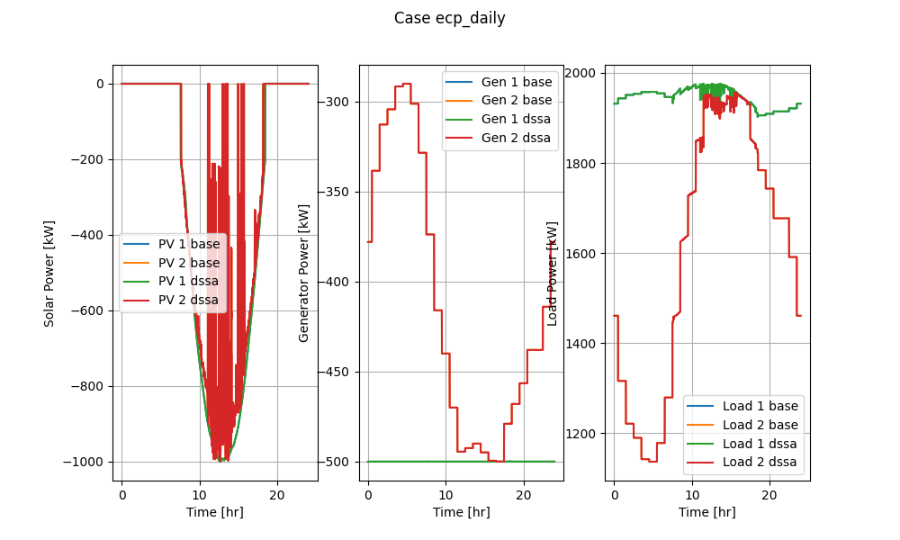
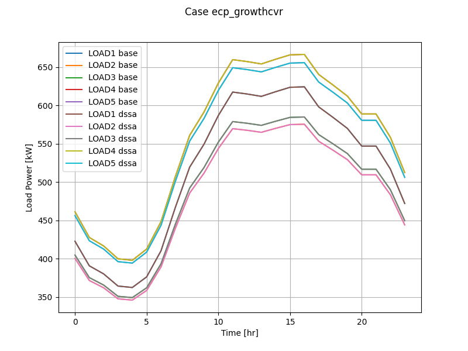
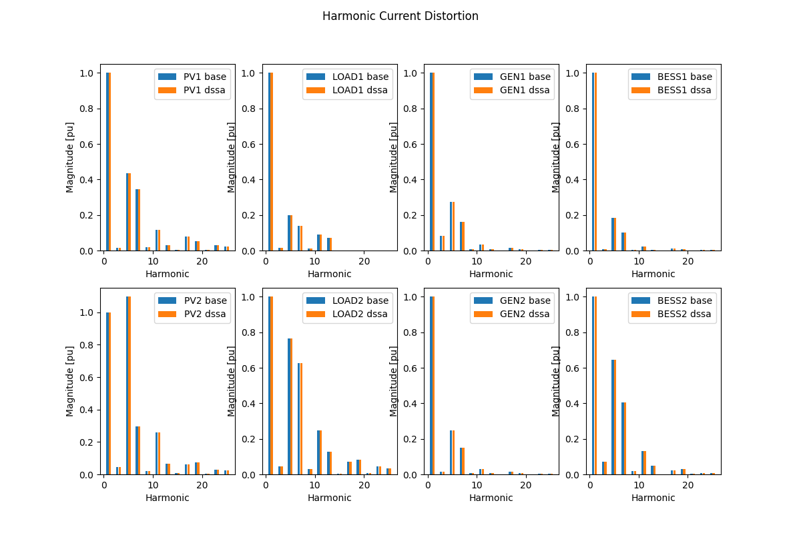
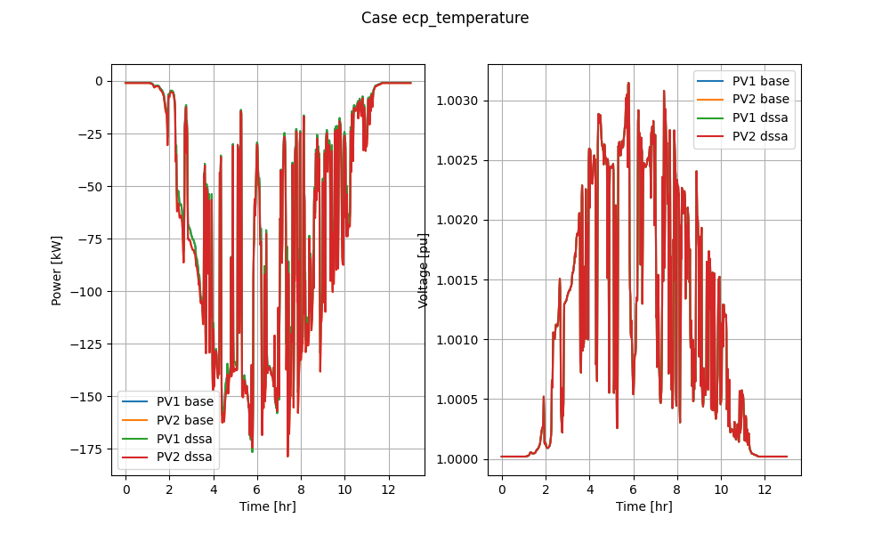

# CIMHub Test Cases for EnergyConnectionProfile

Copyright (c) 2021-2022, Battelle Memorial Institute

The _EnergyConnectionProfile_ CIM extension class supports the conversion of shapes,
curves, players, and schedules ("profiles") for time-series simulations in OpenDSS and
GridLAB-D. References from the network model components to the profiles convert through 
CIMHub. The user has to manage the profile data separately, in format suitable for
the simulator, i.e., CIM classes are not used for the profile data itself.

## Process

The test cases are executed with as follows:

1. Start the Blazegraph engine
2. Invoke `python3 onestep.py` to perform the base model conversion
3. Invoke `python3 onestepa.py` to perform the time-series model conversion for OpenDSS

The test cases are configured by entries in the `cases.json` file. These are:

1. _ecp\_daily_ tests
2. _ecp\_duty_ tests
3. _ecp\_growthcvr_ tests
4. _ecp\_harmonic_ tests
5. _ecp\_temperature_ tests
6. _ecp\_yearly_ tests

## Snapshot Results

The result from _onestep.py_ follows.

```
  OpenDSS branch flow in LINE.SEG1 from FDRHEAD, Base case
  Phs     Volts     rad      Amps     rad         kW          kVAR   PhsPhs     Volts     rad
    A   7354.60 -0.0052     87.13 -1.0418    326.299 + j   551.522     AB    12738.54  0.5184
    B   7354.60 -2.0996     87.13 -3.1362    326.299 + j   551.522     BC    12738.54 -1.5760
    C   7354.60  2.0892     87.13  1.0526    326.299 + j   551.522     CA    12738.54  2.6128
    Total S =   978.898 + j  1654.566
  OpenDSS branch flow in LINE.SEG1 from FDRHEAD, Converted case
  Phs     Volts     rad      Amps     rad         kW          kVAR   PhsPhs     Volts     rad
    A   7354.60 -0.0052     87.13 -1.0418    326.300 + j   551.523     AB    12738.54  0.5184
    B   7354.60 -2.0996     87.13 -3.1362    326.300 + j   551.523     BC    12738.54 -1.5760
    C   7354.60  2.0892     87.13  1.0526    326.300 + j   551.523     CA    12738.54  2.6128
    Total S =   978.899 + j  1654.568
  GridLAB-D branch flow in LINE_SEG1 from FDRHEAD
  Phs     Volts     rad      Amps     rad         kW          kVAR   PhsPhs     Volts     rad
    A   7347.27 -0.0053     89.76 -1.0266    344.421 + j   562.390     AB    12725.85  0.5183
    B   7347.27  4.1835     89.76  3.1622    344.421 + j   562.390     BC    12725.84 -1.5761
    C   7347.27  2.0891     89.76  1.0678    344.421 + j   562.390     CA    12725.84  2.6127
    Total S =  1033.262 + j  1687.170
ecp_daily        Nbus=[    18,    18,    27] Nlink=[    36,    36,    15] MAEv=[ 0.0000, 0.0010] MAEi=[   0.0001,   2.2092]
  OpenDSS branch flow in LINE.SEG1 from FDRHEAD, Base case
  Phs     Volts     rad      Amps     rad         kW          kVAR   PhsPhs     Volts     rad
    A   7742.12  0.0401    106.83 -3.0945   -827.055 + j     5.774     AB    13409.75  0.5637
    B   7742.12 -2.0543    106.83  1.0943   -827.055 + j     5.774     BC    13409.75 -1.5307
    C   7742.12  2.1345    106.83 -1.0001   -827.055 + j     5.774     CA    13409.75  2.6581
    Total S = -2481.165 + j    17.322
  OpenDSS branch flow in LINE.SEG1 from FDRHEAD, Converted case
  Phs     Volts     rad      Amps     rad         kW          kVAR   PhsPhs     Volts     rad
    A   7742.12  0.0401    106.83 -3.0945   -827.055 + j     5.774     AB    13409.75  0.5637
    B   7742.12 -2.0543    106.83  1.0943   -827.055 + j     5.774     BC    13409.75 -1.5307
    C   7742.12  2.1345    106.83 -1.0001   -827.055 + j     5.774     CA    13409.75  2.6581
    Total S = -2481.165 + j    17.322
  GridLAB-D branch flow in LINE_SEG1 from FDRHEAD
  Phs     Volts     rad      Amps     rad         kW          kVAR   PhsPhs     Volts     rad
    A   7719.12  0.0321     86.01  3.1821   -663.918 + j     5.566     AB    13369.91  0.5557
    B   7719.12  4.2209     86.01  1.0877   -663.918 + j     5.566     BC    13369.91 -1.5387
    C   7719.12  2.1265     86.01 -1.0067   -663.918 + j     5.566     CA    13369.91  2.6501
    Total S = -1991.754 + j    16.698
ecp_duty         Nbus=[    18,    18,    24] Nlink=[    30,    30,    15] MAEv=[ 0.0000, 0.0026] MAEi=[   0.0000,   8.3789]
  OpenDSS branch flow in LINE.SEG1 from FDRHEAD, Base case
  Phs     Volts     rad      Amps     rad         kW          kVAR   PhsPhs     Volts     rad
    A   7224.85 -0.0419    164.05 -0.5173   1053.771 + j   542.495     AB    12513.81  0.4817
    B   7224.85 -2.1363    164.05 -2.6117   1053.771 + j   542.495     BC    12513.81 -1.6127
    C   7224.85  2.0525    164.05  1.5771   1053.771 + j   542.495     CA    12513.81  2.5761
    Total S =  3161.313 + j  1627.485
  OpenDSS branch flow in LINE.SEG1 from FDRHEAD, Converted case
  Phs     Volts     rad      Amps     rad         kW          kVAR   PhsPhs     Volts     rad
    A   7302.58 -0.0314    128.81 -0.5424    820.494 + j   460.063     AB    12648.44  0.4922
    B   7302.58 -2.1258    128.81 -2.6368    820.494 + j   460.063     BC    12648.44 -1.6022
    C   7302.58  2.0630    128.81  1.5519    820.494 + j   460.063     CA    12648.44  2.5866
    Total S =  2461.482 + j  1380.190
  GridLAB-D branch flow in LINE_SEG1 from FDRHEAD
  Phs     Volts     rad      Amps     rad         kW          kVAR   PhsPhs     Volts     rad
    A   7318.07 -0.0315    124.52 -0.5221    803.801 + j   429.317     AB    12675.28  0.4921
    B   7318.07  4.1573    124.52  3.6667    803.801 + j   429.317     BC    12675.27 -1.6023
    C   7318.07  2.0629    124.52  1.5723    803.801 + j   429.317     CA    12675.27  2.5865
    Total S =  2411.403 + j  1287.952
ecp_growthcvr    Nbus=[    18,    18,    21] Nlink=[    33,    33,    15] MAEv=[ 0.0107, 0.0129] MAEi=[  19.2234,  31.6192]
  OpenDSS branch flow in LINE.SEG1 from FDRHEAD, Base case
  Phs     Volts     rad      Amps     rad         kW          kVAR   PhsPhs     Volts     rad
    A   7796.71  0.0105     71.77 -1.5432      9.570 + j   559.470     AB    13504.30  0.5341
    B   7796.71 -2.0839     71.77  2.6456      9.570 + j   559.470     BC    13504.30 -1.5603
    C   7796.71  2.1049     71.77  0.5512      9.570 + j   559.470     CA    13504.30  2.6285
    Total S =    28.711 + j  1678.410
  OpenDSS branch flow in LINE.SEG1 from FDRHEAD, Converted case
  Phs     Volts     rad      Amps     rad         kW          kVAR   PhsPhs     Volts     rad
    A   7796.71  0.0105     71.77 -1.5432      9.570 + j   559.472     AB    13504.30  0.5341
    B   7796.71 -2.0839     71.77  2.6456      9.570 + j   559.472     BC    13504.30 -1.5603
    C   7796.71  2.1049     71.77  0.5512      9.570 + j   559.472     CA    13504.30  2.6285
    Total S =    28.711 + j  1678.415
  GridLAB-D branch flow in LINE_SEG1 from FDRHEAD
  Phs     Volts     rad      Amps     rad         kW          kVAR   PhsPhs     Volts     rad
    A   7743.38 -0.0048     84.83 -1.0257    343.262 + j   560.017     AB    13411.93  0.5188
    B   7743.38  4.1840     84.83  3.1631    343.262 + j   560.017     BC    13411.93 -1.5756
    C   7743.38  2.0896     84.83  1.0687    343.262 + j   560.017     CA    13411.93  2.6132
    Total S =  1029.787 + j  1680.050
ecp_harmonic     Nbus=[    18,    18,    30] Nlink=[    42,    42,    15] MAEv=[ 0.0000, 0.0061] MAEi=[   0.0001,   5.6529]
  OpenDSS branch flow in LINE.SEG1 from FDRHEAD, Base case
  Phs     Volts     rad      Amps     rad         kW          kVAR   PhsPhs     Volts     rad
    A   7639.47  0.0052     15.39 -3.1343   -117.558 + j     0.246     AB    13231.95  0.5288
    B   7639.47 -2.0892     15.39  1.0545   -117.558 + j     0.246     BC    13231.95 -1.5656
    C   7639.47  2.0996     15.39 -1.0399   -117.558 + j     0.246     CA    13231.95  2.6232
    Total S =  -352.675 + j     0.739
  OpenDSS branch flow in LINE.SEG1 from FDRHEAD, Converted case
  Phs     Volts     rad      Amps     rad         kW          kVAR   PhsPhs     Volts     rad
    A   7639.47  0.0052     15.39 -3.1343   -117.598 + j     0.246     AB    13231.95  0.5288
    B   7639.47 -2.0892     15.39  1.0545   -117.598 + j     0.246     BC    13231.95 -1.5656
    C   7639.47  2.0996     15.39 -1.0399   -117.598 + j     0.246     CA    13231.95  2.6232
    Total S =  -352.794 + j     0.739
  GridLAB-D branch flow in LINE_SEG1 from FDRHEAD
  Phs     Volts     rad      Amps     rad         kW          kVAR   PhsPhs     Volts     rad
    A   7640.53  0.0061     16.30  3.1493   -124.563 + j     0.200     AB    13233.79  0.5297
    B   7640.53  4.1949     16.30  1.0549   -124.563 + j     0.200     BC    13233.79 -1.5647
    C   7640.53  2.1005     16.30 -1.0395   -124.563 + j     0.200     CA    13233.79  2.6241
    Total S =  -373.690 + j     0.600
ecp_temperature  Nbus=[    18,    18,    21] Nlink=[    24,    24,    15] MAEv=[ 0.0000, 0.0001] MAEi=[   0.0033,   0.5488]
  OpenDSS branch flow in LINE.SEG1 from FDRHEAD, Base case
  Phs     Volts     rad      Amps     rad         kW          kVAR   PhsPhs     Volts     rad
    A   7126.10 -0.0489    197.66 -0.5679   1222.994 + j   698.716     AB    12342.77  0.4747
    B   7126.10 -2.1433    197.66 -2.6623   1222.994 + j   698.716     BC    12342.77 -1.6197
    C   7126.10  2.0455    197.66  1.5265   1222.994 + j   698.716     CA    12342.77  2.5691
    Total S =  3668.983 + j  2096.147
  OpenDSS branch flow in LINE.SEG1 from FDRHEAD, Converted case
  Phs     Volts     rad      Amps     rad         kW          kVAR   PhsPhs     Volts     rad
    A   7126.10 -0.0489    197.66 -0.5679   1222.994 + j   698.716     AB    12342.77  0.4747
    B   7126.10 -2.1433    197.66 -2.6623   1222.994 + j   698.716     BC    12342.77 -1.6197
    C   7126.10  2.0455    197.66  1.5265   1222.994 + j   698.716     CA    12342.77  2.5691
    Total S =  3668.983 + j  2096.147
  GridLAB-D branch flow in LINE_SEG1 from FDRHEAD
  Phs     Volts     rad      Amps     rad         kW          kVAR   PhsPhs     Volts     rad
    A   7058.86 -0.0543    223.57 -0.5776   1366.994 + j   788.604     AB    12226.30  0.4693
    B   7058.86  4.1345    223.57  3.6112   1366.993 + j   788.606     BC    12226.31 -1.6251
    C   7058.86  2.0401    223.57  1.5168   1366.994 + j   788.604     CA    12226.30  2.5637
    Total S =  4100.981 + j  2365.814
ecp_yearly       Nbus=[    18,    18,    21] Nlink=[    24,    24,    15] MAEv=[ 0.0000, 0.0093] MAEi=[   0.0000,  20.7317]

```
## Time Series Results

The result from _onestepa.py_ follows.

### ecp_daily

```
Results from base
Total Energy PV1=-7828.02 PV2=-6963.21 kwh
Total Energy Gen1=-11999.88 Gen2=-9909.84 kwh
Total Energy Load1=46696.12 Load2=38556.70 kwh
Results from dssa
Total Energy PV1=-7828.02 PV2=-6963.21 kwh
Total Energy Gen1=-11999.88 Gen2=-9909.84 kwh
Total Energy Load1=46696.12 Load2=38556.70 kwh
```



### ecp_duty

```
Results from base
Total Energy PV1=-805.28 PV2=-522.46 kwh
Total Energy BESS1=-402.64 BESS2=3.86 kwh
Results from dssa
Total Energy PV1=-805.28 PV2=-522.46 kwh
Total Energy BESS1=-402.64 BESS2=3.86 kwh
```


### ecp_growthcvr

```
Results from base
Total Energy LOAD1 = 11928.77 kwh
Total Energy LOAD2 = 11127.69 kwh
Total Energy LOAD3 = 11283.36 kwh
Total Energy LOAD4 = 12859.48 kwh
Total Energy LOAD5 = 12682.07 kwh
Results from dssa
Total Energy LOAD1 = 11928.77 kwh
Total Energy LOAD2 = 11127.69 kwh
Total Energy LOAD3 = 11283.36 kwh
Total Energy LOAD4 = 12859.48 kwh
Total Energy LOAD5 = 12682.08 kwh
```



### ecp_harmonic

```
Results from base
THDi PV1    =  33.43 %
THDi PV2    = 137.56 %
THDi LOAD1  =   7.29 %
THDi LOAD2  = 107.40 %
THDi GEN1   =  10.86 %
THDi GEN2   =   8.39 %
THDi BESS1  =   4.52 %
THDi BESS2  =  60.54 %
Results from dssa
THDi PV1    =  33.43 %
THDi PV2    = 137.56 %
THDi LOAD1  =   7.29 %
THDi LOAD2  = 107.40 %
THDi GEN1   =  10.86 %
THDi GEN2   =   8.39 %
THDi BESS1  =   4.52 %
THDi BESS2  =  60.54 %
```



### ecp_temperature

```
Results from base
Total Energy PV1=-751.10 PV2=-779.94 kWh
Results from dssa
Total Energy PV1=-751.10 PV2=-779.94 kWh
```



### ecp_yearly

```
Results from base
Total Energy Load1=16859.94 Load2=7004.20 MWh
Results from dssa
Total Energy Load1=16859.94 Load2=7004.20 MWh
```


## Adjustments After Conversion

Explain irradiance and efficiency curves. Explain CVR coefficients.

