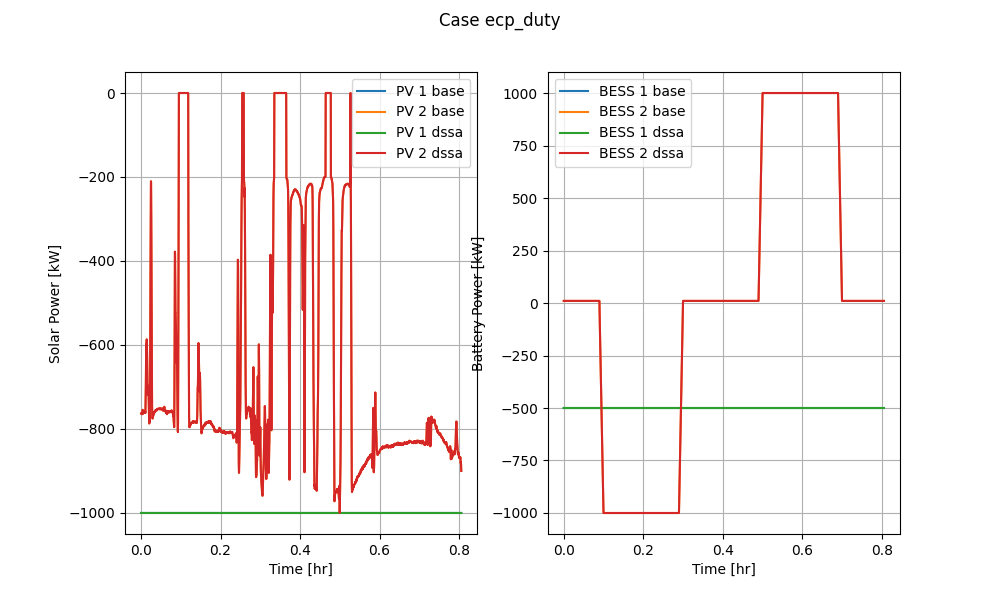

CIMHub Test Cases for EnergyConnectionProfile
=============================================

Copyright (c) 2021-2022, Battelle Memorial Institute

The _EnergyConnectionProfile* CIM extension class supports the conversion 
of shapes, curves, players, and schedules ("profiles") for time-series 
simulations in OpenDSS and GridLAB-D.  References from the network model 
components to the profiles convert through CIMHub.  The user has to manage 
the profile data separately, in format suitable for the simulator, i.e., 
CIM classes are not used for the profile data itself.  

Process
-------

The test cases in *cases.json* are configured as decribed in `Test Case 
Configuration <../README.rst#Test-Case-Configuration>`_.  The 
`Command-Line Reference <../README.rst#Command-Line-Reference>`_ describes 
available **export\_options** for each case.  

The test cases are executed as follows:

1. Start the Blazegraph engine
2. Invoke `python3 onestep.py` to perform the base model conversion
3. Invoke `python3 onestepa.py` to perform the time-series model conversion for OpenDSS

The test cases are configured by entries in the `cases.json` file. These cases are:

1. *ecp\_daily* tests the OpenDSS *daily* shape with solar, storage, load, and generator components
2. *ecp\_duty* tests the OpenDSS *duty cycle* shape with solar and storage components
3. *ecp\_growthcvr* tests the OpenDSS *loadgrowth* and *cvrcurve* with Conservation Load Reduction (CVR) loads
4. *ecp\_harmonic* tests the OpenDSS *spectrum* with solar, storage, load, and generator components
5. *ecp\_temperature* tests the OpenDSS *daily* and *Tdaily* shaps with solar components
6. *ecp\_yearly* tests the OpenDSS *yearly* shape with a load component

Snapshot Results
----------------

The results from *onestep.py* follow, comparing the single snap shot load 
flow solutions before and after model conversion through CIMHub.  The 
OpenDSS MAEv and MAEi values match closely, except for the 
*ecp\_growthcvr* case.  The reason is that the pre-conversion solution is 
at year 10, while the post-conversion solution is at year 0, i.e., with no 
load growth.  This is an automated comparison, which does not allow year 
10 to be specified post-conversion.  These test cases include features not 
supported in GridLAB-D, so the post-conversion GridLAB-D solution doesn't 
match MAEv and MAEi.  

See `Round-trip Validation <../README.rst#Round-trip-Validation>`_ for notes on 
interpreting the `Results <onestep.inc>`_.

..
    literalinclude:: onestep.inc
   :language: none
   However, GitHub README will not support include files

Time Series Results (OpenDSS)
-----------------------------

The results from executing *onestepa.py* follow.  The CIM XML files must 
already have been created from *onestep.py_.  The time series script in 
*onstepa.py* is more complicated, as it customizes the steps that were 
embedded in *convert\_and\_check\_models* for snapshot power flow.  

- The outputs and export options are customized in lines 155-161.
- The CIM XML upload and export steps are broken out in lines 163-167.
- Lines 169-179 set up the time-series power flow tests under `./dssa/`, 
  by copying custom OpenDSS files defined as templates in lines 21-133.

  - Include files named *\*edits.dss* were referenced by the -m *export\_option_. 
    They define necessary OpenDSS shapes for these cases to run.
  - Files named *\*run.dss* call and execute the exported models in *\*base.dss_. 
    In general, these custom files define and export monitors for the time-series data. 
    They also call for solution modes other than snapshot, e.g., daily, yearly, 
    duty, harmonic.
  - In three cases, *\*run.dss* perform manual edits before the time-series / 
    harmonic solution, as required for a few attributes not translated through 
    CIM. Details are explained below.

- Lines 180-181 execute six time-series / harmonic solutions on the exported models.

The built-in function to compare snapshot power flow solutions doesn't 
compare time-series or harmonic solutions.  Therefore, six custom Python 
post-processing programs are provided to compare pre-conversion and 
post-conversion solutions.  

Manual Adjustments to the Exported Model
^^^^^^^^^^^^^^^^^^^^^^^^^^^^^^^^^^^^^^^^

In half of the six cases, manual adjustments were needed to obtain 
matching solutions.  This will occur any time the solution depends on 
parameters not included in CIM.  To make these adjustments, two options 
are available: 

1. Add extra definitions and options to a file like *ecp\_duty\_edits.dss*, 
   which is included just after the circuit definition, i.e., before 
   other components have been defined.
2. Add monitors, energymeters, edits, batchedits, solution options, and solution 
   modes to a file like *ecp\_duty\_run.dss*, just after it includes *ecp\_duty\_base.dss_. 
   The *base* file will have defined all the network components and 
   calculated the voltage bases.

ecp_daily
^^^^^^^^^

Executing *python ecp\_daily.py* produces the tabular and plotted output 
shown below, in which both solutions match.  

`Tabulated Results <ecp_daily.inc>`_

.. image:: ../docs/media/ecp_daily.png

ecp_duty
^^^^^^^^

Executing *python ecp\_duty.py* produces the tabular and plotted output 
shown below, in which both solutions match.  The *dispmode=follow* 
parameter was manually specified at line 49 of *onestepa.py* to achieve 
this match.  This solver-specific parameter is not included in CIM, nor 
presently planned as a CIMHub extension.  

`Tabulated Results <ecp_duty.inc>`_

ecp_growthcvr
^^^^^^^^^^^^^

Executing *python ecp\_growthcvr.py* produces the tabular and plotted 
output shown below, in which both solutions match.  Recall that the 
snapshot power flow solutions did not match, but the time series solutions 
match because both specify year=10.  Some *vminpu*, *cvrwatts*, and 
*cvrvars* parameters were manually specified at lines 77-79 of 
*onestepa.py* to achieve this match.  These solver-specific parameters are 
not included in CIM, nor presently planned as CIMHub extensions.  

`Tabulated Results <ecp_growthcvr.inc>`_

.. image:: ../docs/media/ecp_growthcvr.png

ecp_harmonic
^^^^^^^^^^^^

Executing *python ecp\_harmonic.py* produces the tabular and plotted 
output shown below, in which both solutions match.  

`Tabulated Results <ecp_harmonic.inc>`_

.. image:: ../docs/media/ecp_harmonic.png

ecp_temperature
^^^^^^^^^^^^^^^

Executing *python ecp\_duty.py* produces the tabular and plotted output 
shown below, in which both solutions match.  The *effcurve*, *irradiance*, 
and *P-TCurve* parameters were manually specified at lines 100-101 of 
*onestepa.py* to achieve this match.  These parameters are not included in 
CIM, nor are they planned as CIM extensions.  In many cases, *irradiance* 
converts as expected, but not when the inverter efficiency has been 
defined by the user, as done here.  

`Tabulated Results <ecp_temperature.inc>`_

.. image:: ../docs/media/ecp_temperature.png

ecp_yearly
^^^^^^^^^^

Executing *python ecp\_yearly.py* produces the tabular and plotted output 
shown below, in which both solutions match.  

`Tabulated Results <ecp_yearly.inc>`_

Time Series Results (GridLAB-D)
-------------------------------

The GridLAB-D test case is custom-built to verify that *schedule* and *player*
options work for loads, generators, PV, and storage in GridLAB_D. The simulation
is built and run, including post-export editing commands, using *python testgld.py*.
The tabular and graphical outputs are produced using *python gld\_daily.py*.

gld_daily
^^^^^^^^^

`Tabulated Results <gld_daily.inc>`_

